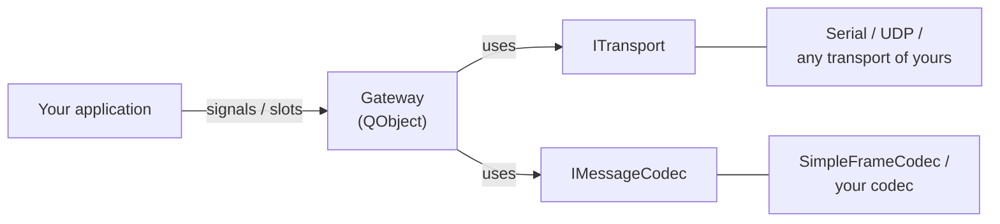

# GChannelManager

> 🌐 **English** | [Русский](README.ru.md)

A Qt6/C++20 shared library for building a protocol communication channel on top of an arbitrary transport (serial port, UDP, RUDP, etc.). The central object is `Gateway`: it manages channel state, a keep-alive session, sending/receiving messages, retries, a reply cache and statistics.

> [!NOTE]
> Anywhere you need reliable exchange of short frames over an unstable link: telemetry, industrial buses, radio channels, command protocols between a microcontroller and a host.

## Features

- **Channel** — `enableChannel()`/`disableChannel()` over any `ITransport`.
- **Session with explicit SessionStart/SessionStartAck/SessionStop frames** — establishment and teardown are independent of keep-alive; configurable handshake timeout.
- **Keep-alive** — heartbeat only in `Active`, an `Active ↔ Suspended` transition without reopening the channel (RUDP-style behavior); on/off on the fly.
- **Request/reply with correlation** — `sendRequest(payload) → GatewayRequest*` with automatic retries and exponential backoff.
- **Fire-and-forget sending** — `send(payload)`, with no reply expected.
- **Server role** — a `requestReceived` signal for incoming requests from the peer, and a `reply(corrId, response)` slot.
- **Reply cache (idempotency)** — a repeated request from the peer gets the stored reply automatically, the command is not executed again.
- **Statistics** — counters for bytes/requests/heartbeats/retries with a periodic `statsUpdated` signal.
- **Clean contracts** — `ITransport` and `IMessageCodec` separate the gateway from the hardware and the frame format.

## Architecture in one picture



A detailed diagram — [docs/en/02-Architecture.md](docs/en/02-Architecture.md).

## Build

```sh
cmake -S . -B build/Desktop-Debug -DCMAKE_BUILD_TYPE=Debug
cmake --build build/Desktop-Debug
```

Optional modules:

| Option | Default | What gets built |
|---|---|---|
| `GCHANNELMANAGER_BUILD_EXAMPLES` | `OFF` | `examples/GChannelManagerDemo` — a loopback demo with losses and retries |
| `GCHANNELMANAGER_BUILD_TESTS`    | `OFF` | unit tests on Qt Test (`tst_SimpleFrameCodec`, `tst_Gateway`) |

Run the tests:

```sh
cmake -S . -B build/Desktop-Debug -DGCHANNELMANAGER_BUILD_TESTS=ON
cmake --build build/Desktop-Debug
( cd build/Desktop-Debug && LD_LIBRARY_PATH="$PWD" ctest --output-on-failure )
```

More — [docs/en/08-Build-and-Integration.md](docs/en/08-Build-and-Integration.md).

## Minimal example

```cpp
#include <GChannelManager/Gateway.h>
#include <GChannelManager/SimpleFrameCodec.h>
#include "MySerialTransport.h"   // your ITransport implementation

Gateway gw;
gw.setCodec(std::make_unique<SimpleFrameCodec>());
gw.setTransport(std::make_unique<MySerialTransport>(
    transport::SerialConfig{ .portName = "/dev/ttyUSB0", .baudRate = 115200 }));

QObject::connect(&gw, &Gateway::sessionStateChanged,
    [&](Gateway::SessionState s) {
        if (s != Gateway::SessionState::Active) return;
        auto *req = gw.sendRequest(QByteArray("HELLO"));
        QObject::connect(req, &GatewayRequest::succeeded,
            [](const QByteArray &resp) { qInfo() << "got" << resp; });
    });

gw.enableChannel();   // everything from here is event-driven
```

A full step-by-step walkthrough — [docs/en/10-User-Guide.md](docs/en/10-User-Guide.md).

## Documentation

The documentation lives in [`docs/`](docs/), split by language, and can be read in two ways:

- **On GitHub** — navigate via the links below; Mermaid diagrams render right in the browser.
- **In Obsidian** — open the `docs/` folder as a vault.

| # | File | About |
|---|---|---|
| 1 | [Overview](docs/en/01-Overview.md) | What it is, why, key features |
| 2 | [Architecture](docs/en/02-Architecture.md) | Layers, components, threading, source layout |
| 3 | [States and transitions](docs/en/03-States-and-Transitions.md) | `ChannelState`, `SessionState`, behavior on a drop |
| 4 | [Protocol and codec](docs/en/04-Protocol-and-Codec.md) | `IMessageCodec`, frame format, your own codec |
| 5 | [Transport](docs/en/05-Transport.md) | `ITransport`, `SerialConfig`/`UdpConfig`, implementations |
| 6 | [Gateway API](docs/en/06-Gateway-API.md) | Complete public API reference |
| 7 | [Statistics](docs/en/07-Statistics.md) | `GatewayStats`, counters, `statsUpdated` |
| 8 | [Build and integration](docs/en/08-Build-and-Integration.md) | CMake, options, export, consumption |
| 9 | [Testing](docs/en/09-Testing.md) | Qt Test, `FakeTransport`, test patterns |
| 10 | [User guide](docs/en/10-User-Guide.md) | Step-by-step walkthrough with code |

> 🌐 Russian documentation is in [`docs/ru/`](docs/ru/).

## Dependencies

- C++20 (GCC 10+, Clang 11+, MSVC 19.29+)
- CMake ≥ 3.16
- Qt 6 (`Core`, `Network`); Qt 5 is supported via `find_package(QT NAMES Qt6 Qt5)`
- For the tests — Qt Test (`Qt6::Test`)

## Project structure

```
GChannelManager/
├── include/GChannelManager/   ← public headers
├── src/                       ← implementation (.so/.dll)
├── examples/                  ← demo loopback (GCHANNELMANAGER_BUILD_EXAMPLES=ON)
├── tests/                     ← unit tests     (GCHANNELMANAGER_BUILD_TESTS=ON)
├── docs/                      ← documentation (en/ + ru/)
└── CMakeLists.txt
```
