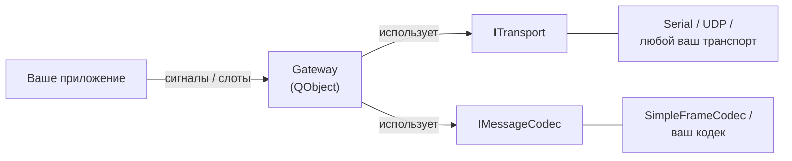

# GChannelManager

> 🌐 [English](README.md) | **Русский**

> [!WARNING]
> **Проект во «vibe coding».** Эта библиотека написана целиком в стиле vibe coding — почти полностью сгенерирована ИИ-ассистентом, включая эту документацию. В продакшене она **не** обкатана. Внимательно читайте код и тщательно тестируйте перед использованием.

Qt6/C++20 разделяемая библиотека для построения протокольного канала связи поверх произвольного транспорта (последовательный порт, UDP, RUDP и т.п.). Главный объект — `Gateway`: он управляет состоянием канала, сессией с keep-alive, отправкой/приёмом сообщений, повторами, кэшем ответов и статистикой.

> [!NOTE]
> Везде, где нужен надёжный обмен короткими кадрами по нестабильной линии: телеметрия, промышленные шины, радиоканалы, протоколы команд между микроконтроллером и хостом.

## Возможности

- **Канал** — `enableChannel()`/`disableChannel()` поверх любого `ITransport`.
- **Сессия с явными кадрами SessionStart/SessionStartAck/SessionStop** — установление и завершение не зависят от keep-alive; настраиваемый таймаут handshake.
- **Keep-alive** — heartbeat только в `Active`, переход `Active ↔ Suspended` без переоткрытия канала (поведение в духе RUDP); включение/выключение на лету.
- **Запрос/ответ с корреляцией** — `sendRequest(payload) → GatewayRequest*` с автоповторами и экспоненциальным backoff.
- **Fire-and-forget отправка** — `send(payload)`, без ожидания ответа.
- **Серверная роль** — сигнал `requestReceived` для входящих запросов от узла, слот `reply(corrId, response)`.
- **Кэш ответов (idempotency)** — повторный запрос от узла получает сохранённый ответ автоматически, команда повторно не выполняется.
- **Статистика** — счётчики байт/запросов/heartbeat'ов/повторов с периодическим сигналом `statsUpdated`.
- **Чистые контракты** — `ITransport` и `IMessageCodec` отделяют гейтвей от железа и формата кадра.

## Архитектура одной картинкой



Подробная схема — [docs/ru/02-Архитектура.md](docs/ru/02-Архитектура.md).

## Сборка

```sh
cmake -S . -B build/Desktop-Debug -DCMAKE_BUILD_TYPE=Debug
cmake --build build/Desktop-Debug
```

Опциональные модули:

| Опция | По умолчанию | Что собирается |
|---|---|---|
| `GCHANNELMANAGER_BUILD_EXAMPLES` | `OFF` | `examples/GChannelManagerDemo` — loopback-демо с потерями и повторами |
| `GCHANNELMANAGER_BUILD_TESTS`    | `OFF` | юнит-тесты на Qt Test (`tst_SimpleFrameCodec`, `tst_Gateway`) |

Запустить тесты:

```sh
cmake -S . -B build/Desktop-Debug -DGCHANNELMANAGER_BUILD_TESTS=ON
cmake --build build/Desktop-Debug
( cd build/Desktop-Debug && LD_LIBRARY_PATH="$PWD" ctest --output-on-failure )
```

Подробнее — [docs/ru/08-Сборка-и-интеграция.md](docs/ru/08-Сборка-и-интеграция.md).

## Минимальный пример

```cpp
#include <GChannelManager/Gateway.h>
#include <GChannelManager/SimpleFrameCodec.h>
#include "MySerialTransport.h"   // ваша реализация ITransport

Gateway gw;
gw.setCodec(std::make_unique<SimpleFrameCodec>());
gw.setTransport(std::make_unique<MySerialTransport>(
    transport::SerialConfig{ .portName = "/dev/ttyUSB0", .baudRate = 115200 }));

QObject::connect(&gw, &Gateway::sessionStateChanged,
    [&](Gateway::SessionState s) {
        if (s != Gateway::SessionState::Active) return;
        auto *req = gw.sendRequest(QByteArray("HELLO"));
        QObject::connect(req, &GatewayRequest::succeeded,
            [](const QByteArray &resp) { qInfo() << "got" << resp; });
    });

gw.enableChannel();   // дальше всё событийно
```

Полный пошаговый разбор — [docs/ru/10-Руководство-пользователя.md](docs/ru/10-Руководство-пользователя.md).

## Документация

Документация лежит в [`docs/ru/`](docs/ru/) и читается двумя способами:

- **На GitHub** — навигация по ссылкам ниже, Mermaid-схемы рендерятся прямо в браузере.
- **В Obsidian** — откройте папку `docs/` как vault.

| # | Файл | О чём |
|---|---|---|
| 1 | [Обзор](docs/ru/01-Обзор.md) | Что это, зачем, ключевые возможности |
| 2 | [Архитектура](docs/ru/02-Архитектура.md) | Слои, компоненты, потоки, структура исходников |
| 3 | [Состояния и переходы](docs/ru/03-Состояния-и-переходы.md) | `ChannelState`, `SessionState`, поведение при разрыве |
| 4 | [Протокол и кодек](docs/ru/04-Протокол-и-кодек.md) | `IMessageCodec`, формат кадра, свой кодек |
| 5 | [Транспорт](docs/ru/05-Транспорт.md) | `ITransport`, `SerialConfig`/`UdpConfig`, реализации |
| 6 | [Gateway API](docs/ru/06-Gateway-API.md) | Полная справка по публичному API |
| 7 | [Статистика](docs/ru/07-Статистика.md) | `GatewayStats`, счётчики, `statsUpdated` |
| 8 | [Сборка и интеграция](docs/ru/08-Сборка-и-интеграция.md) | CMake, опции, экспорт, потребление |
| 9 | [Тестирование](docs/ru/09-Тестирование.md) | Qt Test, `FakeTransport`, паттерны тестов |
| 10 | [Руководство пользователя](docs/ru/10-Руководство-пользователя.md) | Пошаговый разбор с кодом |

## Зависимости

- C++20 (GCC 10+, Clang 11+, MSVC 19.29+)
- CMake ≥ 3.16
- Qt 6 (`Core`, `Network`); Qt 5 поддерживается через `find_package(QT NAMES Qt6 Qt5)`
- Для тестов — Qt Test (`Qt6::Test`)

## Структура проекта

```
GChannelManager/
├── include/GChannelManager/   ← публичные заголовки
├── src/                       ← реализация (.so/.dll)
├── examples/                  ← demo-loopback (GCHANNELMANAGER_BUILD_EXAMPLES=ON)
├── tests/                     ← юнит-тесты    (GCHANNELMANAGER_BUILD_TESTS=ON)
├── docs/                      ← документация (en/ + ru/)
└── CMakeLists.txt
```
