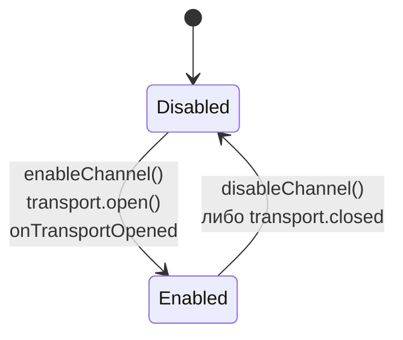
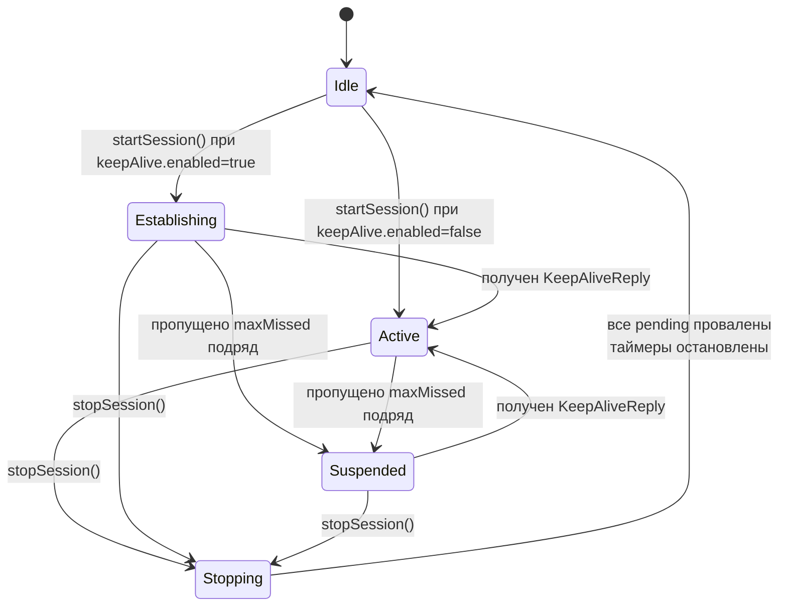
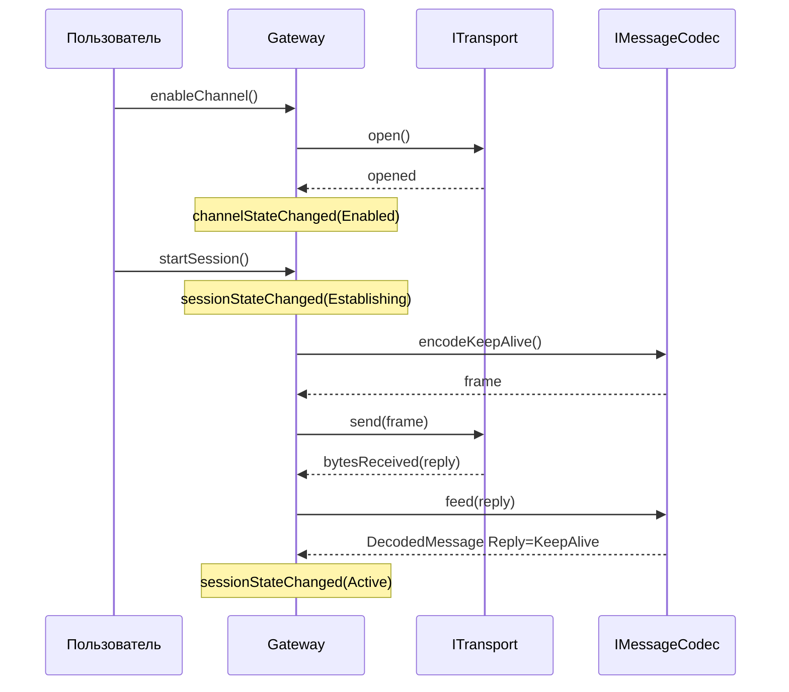
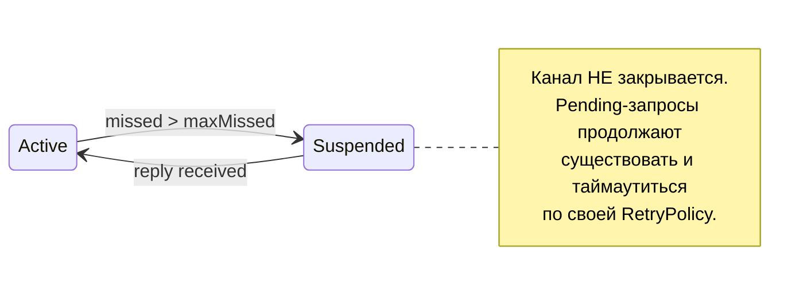

# Состояния и переходы

В `Gateway` живут две независимые машины состояний: **канал** (физический транспорт) и **сессия** (логический протокол с heartbeat). Канал может быть включён без активной сессии. Сессия не может существовать без включённого канала.

## Канал

Канал — это включён ли транспорт. Состояний два:



| Состояние | Что значит | Что можно делать |
|---|---|---|
| `Disabled` | Транспорт закрыт | `enableChannel()`; нельзя `startSession()` |
| `Enabled`  | Транспорт открыт и готов передавать байты | `startSession()`; `disableChannel()` |

> [!NOTE]
> `enableChannel()` асинхронна: реальный переход в `Enabled` наступает после `ITransport::opened()`. Подпишитесь на сигнал `channelStateChanged`, чтобы реагировать на готовность.

## Сессия

Сессия — это логический "разговор" поверх канала: keep-alive подтверждает живость линии, запросы корреллируются по `correlationId`. У сессии пять состояний:



| Состояние | Описание |
|---|---|
| `Idle` | Сессии нет. `sendRequest`/`send` → `SessionInactive` |
| `Establishing` | Сессия запускается, ждём первый `KeepAliveReply` |
| `Active` | Линия подтверждена; запросы идут как обычно |
| `Suspended` | Linkliv "молчит" `maxMissed+1` раз подряд. Канал ещё открыт. Запросы пока ставятся в pending и могут таймаутнуть |
| `Stopping` | Транзитное состояние внутри `stopSession()` |

> [!TIP] Зачем `Suspended`
> В нестабильном радиоканале короткие "провалы" — это норма. Закрывать транспорт и заново его открывать дорого. `Suspended` позволяет переждать обрыв, не теряя установленных настроек (порт, параметры сокета), и автоматически вернуться в `Active`, как только heartbeat ответит.

## Связка канала и сессии



## Что происходит при разрыве

Если транспорт молчит `keepAlive.maxMissed + 1` тиков подряд:

1. Gateway сам, без обращения к транспорту, переводит сессию в `Suspended`.
2. Канал остаётся `Enabled` — байты могут продолжать идти, просто peer не отвечает.
3. Когда придёт хотя бы один `KeepAliveReply`, `onKeepAliveReply()` сбросит счётчик и вернёт `Active`.



## Включение и выключение keep-alive на лету

`setKeepAliveEnabled(bool)` и `setKeepAliveConfig(...)` работают в любой момент:

| Было / стало | Сессия `Active` | Сессия `Establishing` | Сессия `Suspended` |
|---|---|---|---|
| `false → true` | Стартует heartbeat-таймер, шлёт первый kalive | То же | То же |
| `true → false` | Таймер останавливается; счётчик пропусков обнуляется | Переходит в `Active` | Переходит в `Active` |
| только `interval` сменился | `QTimer::setInterval(...)` | то же | то же |

Логика: если heartbeat выключен, его пропусков быть не может, значит "линия живая по умолчанию".

См. реализацию: `src/Gateway.cpp:42` (`setKeepAliveConfig`).

## Сигналы переходов

```cpp
signals:
    void channelStateChanged(Gateway::ChannelState state);
    void sessionStateChanged(Gateway::SessionState state);
    void keepAliveEnabledChanged(bool enabled);
```

Подписаться следует **до** вызовов `enableChannel()`/`startSession()`, иначе можно пропустить ранние переходы.
