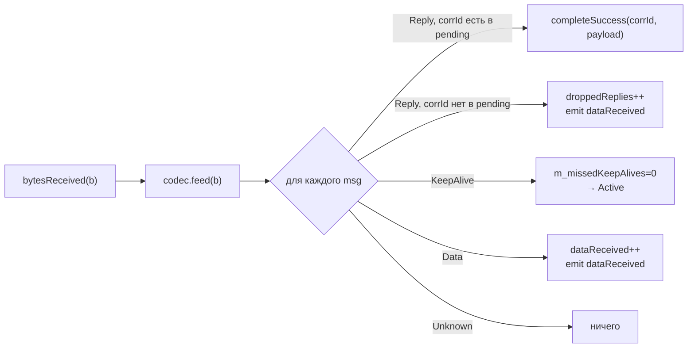

# Протокол и кодек

## Контракт `IMessageCodec`

Кодек — это всё, что библиотека знает о вашем протоколе. Контракт минимален:

```cpp
class IMessageCodec {
public:
    virtual ~IMessageCodec() = default;

    [[nodiscard]] virtual QByteArray encodeRequest(quint32 correlationId,
                                                   const QByteArray &payload) = 0;
    [[nodiscard]] virtual QByteArray encodeData(const QByteArray &payload) = 0;
    [[nodiscard]] virtual QByteArray encodeKeepAlive() = 0;
    [[nodiscard]] virtual std::vector<DecodedMessage> feed(const QByteArray &bytes) = 0;
    virtual void reset() {}
};
```

| Метод | Когда вызывает Gateway | Что должен вернуть |
|---|---|---|
| `encodeRequest(corrId, payload)` | при `sendRequest()` | готовый кадр (байты для `transport.send`) |
| `encodeData(payload)` | при `send()` (fire-and-forget) | кадр без корреляции |
| `encodeKeepAlive()` | по таймеру keep-alive | heartbeat-кадр |
| `feed(bytes)` | при каждом `bytesReceived` | список разобранных сообщений |
| `reset()` | при `startSession()` | очистить внутренний буфер |

## `DecodedMessage`

`feed()` возвращает поток типизированных сообщений:

```cpp
struct DecodedMessage {
    enum class Type {
        Reply,      // ответ на наш запрос → смотрим correlationId
        KeepAlive,  // keep-alive (подтверждение живости линка)
        Data,       // данные без корреляции (push от узла)
        Unknown     // не распознано / служебное
    };
    Type       type          = Type::Unknown;
    quint32    correlationId = 0;   // valid для Reply
    QByteArray payload;
};
```

Gateway обрабатывает их в `onTransportBytes()`:



> [!NOTE] Буферизация
> `feed()` должен **буферизовать** неполные кадры между вызовами. Это часть контракта: транспорт может доставить произвольную часть кадра в одном `bytesReceived`, остаток — в следующем.

## SimpleFrameCodec

`SimpleFrameCodec` — эталонная реализация. Это **пример**, а не часть контракта: в продакшене вы пишете свой кодек под свой протокол.

### Формат кадра

Little-endian, фиксированный заголовок 10 байт:

```
 0       1       2  3  4  5    6  7  8  9    10 ............
┌───────┬───────┬─────────────┬─────────────┬──────────────────┐
│ magic │ type  │   corrId    │     len     │     payload      │
│ 0xA5  │ u8    │   u32 LE    │   u32 LE    │   len байт       │
└───────┴───────┴─────────────┴─────────────┴──────────────────┘
   1       1          4             4          переменно
```

Значения `type`:

| Имя              | Значение | Когда отправляется | Тип в `DecodedMessage` |
|---|---|---|---|
| `Request`        | 1 | `encodeRequest(corrId, payload)` | `Unknown` (на приёме фиксируется только узлом-собеседником) |
| `Reply`          | 2 | (узел отправляет в ответ)        | `Reply` |
| `KeepAliveReq`   | 3 | `encodeKeepAlive()`              | `Unknown` (peer отвечает `KeepAliveReply`) |
| `KeepAliveReply` | 4 | (узел отправляет в ответ)        | `KeepAlive` |
| `Data`           | 5 | `encodeData(payload)` (fire-and-forget) | `Data` |

> [!NOTE]
> `corrId == 0` зарезервирован для keep-alive и fire-and-forget. Реальные `Request`-кадры получают `corrId ≥ 1`.

### Ресинхронизация по `magic`

Если в начале буфера нет `0xA5`, парсер сдвигает позицию на 1 байт и ищет magic заново. Это позволяет восстановиться после мусора на линии без полного сброса буфера.

### API утилит

`SimpleFrameCodec` экспортирует два статических метода-удобства, чтобы вы могли строить тестовые узлы/loopback-транспорты (как в `examples/demo_peer.cpp`):

```cpp
static QByteArray makeFrame(quint8 type, quint32 corrId, const QByteArray &payload);
static std::vector<RawFrame> parse(QByteArray &buffer);   // потребляет разобранное
```

`parse()` — низкоуровневый: возвращает структуру `RawFrame{type, corrId, payload}` без классификации `DecodedMessage::Type`. Удобен в тестах и демо.

## Написание собственного кодека

Минимум — реализовать четыре `encode*`/`feed` (`reset` опционален):

```cpp
class MyProtocolCodec : public IMessageCodec {
public:
    QByteArray encodeRequest(quint32 corrId, const QByteArray &p) override {
        return makeFrame(MY_REQUEST, corrId, p);
    }
    QByteArray encodeData(const QByteArray &p) override {
        return makeFrame(MY_DATA, 0, p);     // corrId не используем
    }
    QByteArray encodeKeepAlive() override {
        return makeFrame(MY_HEARTBEAT, 0, {});
    }
    std::vector<DecodedMessage> feed(const QByteArray &bytes) override {
        m_buf.append(bytes);
        std::vector<DecodedMessage> out;
        // ... парсинг + классификация → out.push_back(...)
        return out;
    }
    void reset() override { m_buf.clear(); }
private:
    QByteArray m_buf;
};
```

После этого:

```cpp
gw.setCodec(std::make_unique<MyProtocolCodec>());
```

Подробнее про правила реализации — в [setCodec](06-Gateway-API.md#setcodec).
