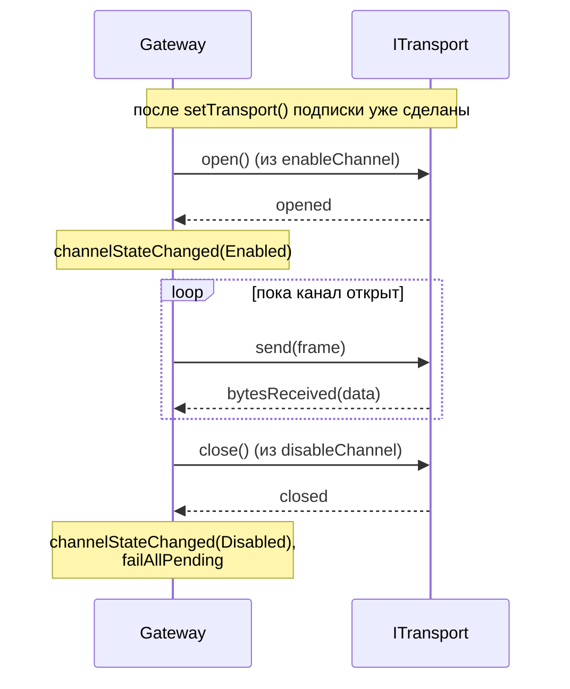

# Транспорт

## Контракт `ITransport`

Транспорт — это асинхронный канал байт. Библиотека опирается ровно на этот интерфейс:

```cpp
class ITransport : public QObject {
    Q_OBJECT
public:
    enum class State { Closed, Opening, Open, Closing, Error };
    Q_ENUM(State)

    [[nodiscard]] virtual State   state() const = 0;
    [[nodiscard]] virtual QString name()  const = 0;
    [[nodiscard]] bool isOpen() const { return state() == State::Open; }

public slots:
    virtual void open()  = 0;
    virtual void close() = 0;
    virtual qint64 send(const QByteArray &data) = 0;

signals:
    void stateChanged(ITransport::State state);
    void opened();
    void closed();
    void bytesReceived(const QByteArray &data);
    void errorOccurred(const QString &message);
};
```

## Правила реализации

| Правило | Что значит |
|---|---|
| `open()` асинхронен | Метод **возвращается сразу**, фактическое открытие подтверждается сигналом `opened()` (или `errorOccurred()`) |
| `close()` асинхронен | То же: сигнал `closed()` приходит позже |
| `send()` неблокирующий | Должен поставить данные в очередь и вернуться без задержек. Возвращает количество принятых байт или `-1` при ошибке |
| `bytesReceived()` | Содержит **сырые байты** (произвольный кусок). Gateway отдаёт их кодеку через `feed()`, кодек буферизует |
| Состояния | `Opening`/`Closing` — транзитные; `Error` — терминальное (требуется явный `open()` для повторной попытки) |

> [!WARNING]
> Не вызывайте сигналы синхронно изнутри `open()`/`close()`/`send()` напрямую: при сборке цепочек `connect(...)` это может привести к перевызовам и зависаниям. Используйте `QMetaObject::invokeMethod(..., Qt::QueuedConnection)` или `QTimer::singleShot(0, this, ...)`.

## Что Gateway делает с транспортом



При получении `errorOccurred` гейтвей не закрывает канал автоматически (это решение остаётся за пользователем) — он лишь пробрасывает сообщение наружу через свой собственный `Gateway::errorOccurred("transport: …")`.

## Конфигурация транспорта

В `include/GChannelManager/TransportConfig.h` живут структуры-настройки для типичных реализаций:

### SerialConfig

```cpp
namespace transport {

struct SerialConfig {
    QString portName;                 // "COM3", "/dev/ttyUSB0"
    qint32  baudRate = 115200;
    qint32  dataBits = 8;

    enum class Parity      { None, Even, Odd, Space, Mark };
    enum class StopBits    { One, OneAndHalf, Two };
    enum class FlowControl { None, Hardware, Software };

    Parity      parity      = Parity::None;
    StopBits    stopBits    = StopBits::One;
    FlowControl flowControl = FlowControl::None;

    std::chrono::milliseconds writeTimeout{500};
};

}
```

### UdpConfig

```cpp
struct UdpConfig {
    QHostAddress localAddress  = QHostAddress::AnyIPv4;
    quint16      localPort     = 0;       // 0 — любой свободный
    QHostAddress remoteAddress;           // адрес узла назначения
    quint16      remotePort    = 0;
    bool         bindBeforeSend = true;   // привязать сокет при open()
};
```

> [!NOTE]
> Сами реализации `SerialTransport` и `UdpTransport` **не входят** в библиотеку: они должны быть написаны под ваш Qt-стек (`QtSerialPort`, `QtNetwork`). Структуры выше — только определения данных, чтобы контракт оставался "лёгким" и не тащил эти модули как зависимости.

## Минимальная реализация — пример из `tests/`

В тестах используется `FakeTransport` — простой управляемый транспорт без реального ввода-вывода:

```cpp
class FakeTransport : public ITransport {
    Q_OBJECT
public:
    using ITransport::ITransport;

    State   state() const override { return m_state; }
    QString name()  const override { return QStringLiteral("fake"); }

    void simulateReceive(const QByteArray &bytes) {
        if (m_state == State::Open)
            emit bytesReceived(bytes);
    }

public slots:
    void open() override {
        m_state = State::Open;
        emit stateChanged(m_state);
        emit opened();
    }
    void close() override {
        m_state = State::Closed;
        emit stateChanged(m_state);
        emit closed();
    }
    qint64 send(const QByteArray &data) override {
        if (m_state != State::Open) return -1;
        m_sent.append(data);
        return data.size();
    }

private:
    State              m_state = State::Closed;
    QList<QByteArray>  m_sent;
};
```

Полный код — в `tests/FakeTransport.h`. Это же шаблон для любой будущей реализации.

## Loopback с задержками и потерями — `demo_peer.cpp`

`examples/demo_peer.cpp` показывает чуть более реалистичный демо-транспорт: он имитирует узел-ответчик, отвечает с задержкой через `QTimer::singleShot`, и случайно "теряет" ~40% запросов, чтобы наглядно демонстрировать работу повторов в `Gateway`. Включить сборку — флаг `-DGCHANNELMANAGER_BUILD_EXAMPLES=ON` (см. [Сборка и интеграция](08-Сборка-и-интеграция.md)).
