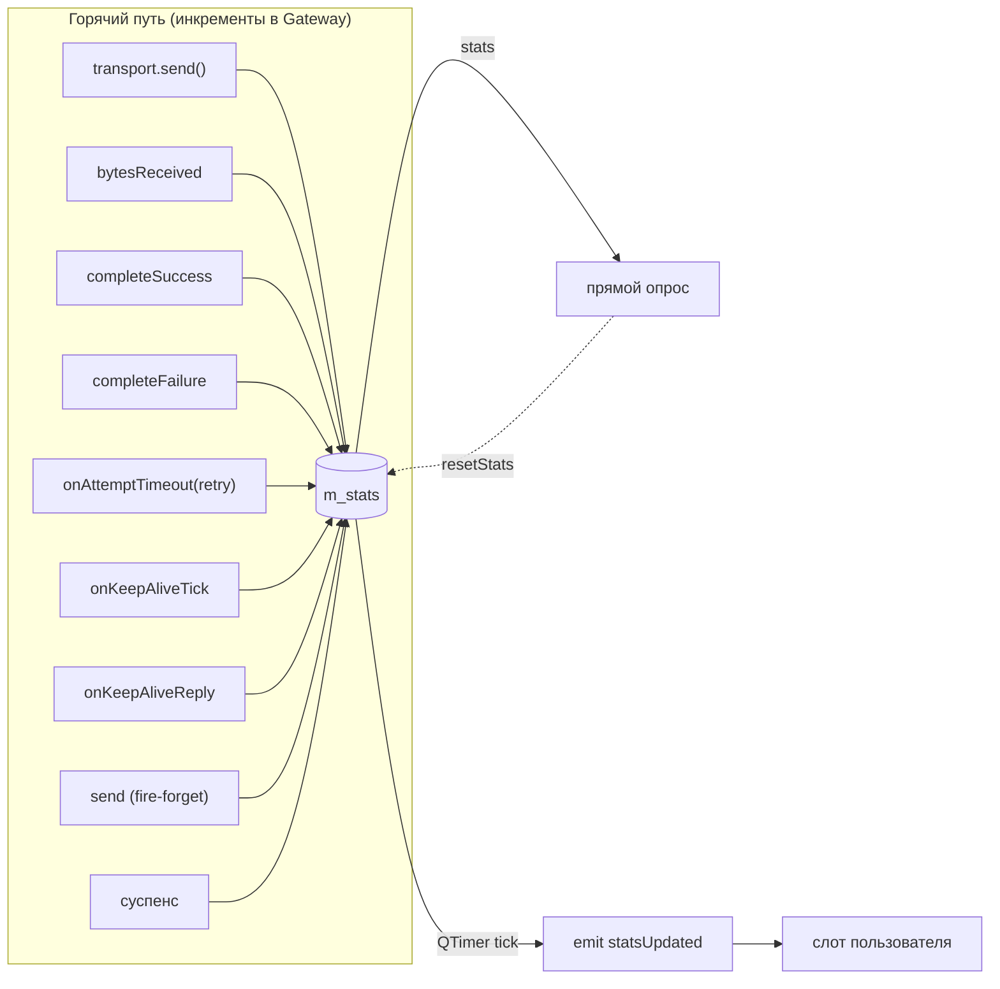

# Статистика

Lightweight-наблюдение за активностью гейтвея: байты, запросы, retry, heartbeat'ы, дропы. Дёшево в горячем пути — обычные инкременты `quint64`. Можно опрашивать по требованию или подписаться на периодический сигнал.

## `GatewayStats`

POD-структура (`include/GChannelManager/GatewayStats.h`):

```cpp
struct GatewayStats {
    quint64 sentBytes          = 0;
    quint64 recvBytes          = 0;
    quint64 requestsSent       = 0;
    quint64 requestsSucceeded  = 0;
    quint64 requestsFailed     = 0;
    quint64 retries            = 0;
    quint64 fireAndForgetSent  = 0;
    quint64 keepAlivesSent     = 0;
    quint64 keepAlivesReceived = 0;
    quint64 suspensions        = 0;
    quint64 droppedReplies     = 0;
    quint64 dataReceived       = 0;
};
Q_DECLARE_METATYPE(GatewayStats)
```

## Когда какой счётчик растёт

| Счётчик | Инкрементируется при |
|---|---|
| `sentBytes` | каждый успешный `transport->send(frame)` (keep-alive, fire-and-forget, попытки запроса, ретраи) |
| `recvBytes` | каждый `onTransportBytes(bytes)` (сырые байты до парсинга) |
| `requestsSent` | `sendRequest` после прохождения предусловий и вставки в `m_pending` |
| `requestsSucceeded` | `completeSuccess()` — пришёл `Reply` с известным `corrId` |
| `requestsFailed` | `completeFailure()` или `failLater()` (предусловия не прошли, таймаут, cancel, разрыв) |
| `retries` | повторная попытка по таймауту (т.е. `onAttemptTimeout` решает "retry, not timeout") |
| `fireAndForgetSent` | успешный `Gateway::send(payload)` |
| `keepAlivesSent` | каждый тик `onKeepAliveTick`, отправивший heartbeat |
| `keepAlivesReceived` | `onKeepAliveReply()` (пришёл `DecodedMessage::Type::KeepAlive`) |
| `suspensions` | переход `Active`/`Establishing` → `Suspended` из-за пропуска heartbeat'ов |
| `droppedReplies` | `Reply` с `corrId`, которого нет в pending (поздний ответ / чужой) |
| `dataReceived` | `DecodedMessage::Type::Data` от кодека |

> [!info] Что не считается
> Состояния канала (`Disabled`/`Enabled`) и переходы сессии (кроме `suspensions`) не имеют отдельных счётчиков — они и так наблюдаемы через сигналы `channelStateChanged`/`sessionStateChanged`.

## API

```cpp
[[nodiscard]] GatewayStats stats() const;            // снимок на сейчас
void setStatsInterval(std::chrono::milliseconds);    // 0 — отключить
[[nodiscard]] std::chrono::milliseconds statsInterval() const;
void resetStats();                                   // обнулить все поля

signals:
    void statsUpdated(GatewayStats stats);
```

## Периодический эмит

По умолчанию `statsInterval = 0`, периодический сигнал не идёт. Включается одним вызовом:

```cpp
gw.setStatsInterval(std::chrono::milliseconds(1000));
connect(&gw, &Gateway::statsUpdated, this, &Dashboard::onStats);
```

Отключение:

```cpp
gw.setStatsInterval(std::chrono::milliseconds(0));
```

Под капотом — отдельный `QTimer` (`m_statsTimer`), независимый от `keep-alive`. Эмит идёт **полным снимком**, без diff'а: дашборд сам решает, сравнивать с прошлым значением или нет.

## Пример сборки метрик

```cpp
class Dashboard : public QObject {
    Q_OBJECT
public slots:
    void onStats(const GatewayStats &s)
    {
        const double lossRate = (s.requestsSent == 0)
            ? 0.0
            : double(s.requestsFailed) / double(s.requestsSent);

        qInfo().nospace()
            << "tx=" << s.sentBytes << "B  rx=" << s.recvBytes << "B  "
            << "req(ok/fail/retry)=" << s.requestsSucceeded
            << "/" << s.requestsFailed
            << "/" << s.retries
            << "  loss=" << QString::number(lossRate * 100, 'f', 1) << "%"
            << "  suspensions=" << s.suspensions;
    }
};
```

## Поток данных счётчиков



## Проверка в тестах

В `tests/tst_Gateway.cpp` четыре кейса:

- `stats_countersTrackKeepAliveAndRequest` — keep-alive счётчики и `requestsSucceeded` после round-trip.
- `stats_droppedReplyCounted` — `Reply` с неизвестным `corrId` → `droppedReplies == 1`.
- `stats_periodicSignalFires_andStopsOnZeroInterval` — таймер эмитит, `setStatsInterval(0)` останавливает.
- `stats_resetClearsCounters` — `resetStats()` обнуляет всё.

См. подробности — [[09-Тестирование]].
