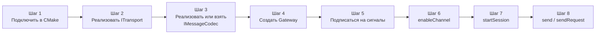
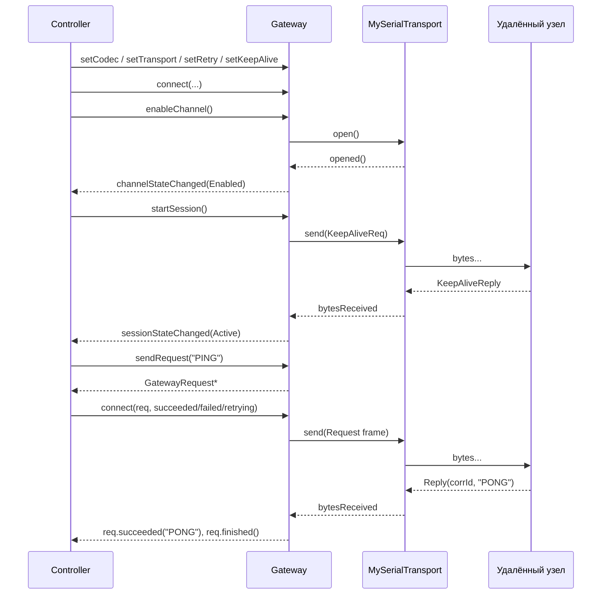

# Руководство пользователя

Пошаговый разбор того, как подключить `GChannelManager` к реальному проекту. Параллельно — куда смотреть в документации, если нужно глубже.

## Карта шагов



## Шаг 1. Подключение в CMake

Положите репозиторий рядом или в `third_party/`:

```cmake
add_subdirectory(third_party/GChannelManager)
target_link_libraries(myapp PRIVATE GChannelManager)
```

После этого работают includes:

```cpp
#include <GChannelManager/Gateway.h>
#include <GChannelManager/SimpleFrameCodec.h>
// ... ваш транспорт
```

Подробности и опции — [Сборка и интеграция](08-Сборка-и-интеграция.md).

## Шаг 2. Транспорт

Транспорт — единственное, что вам почти всегда придётся писать с нуля: библиотека сознательно не тянет `QtSerialPort`/`QtNetwork`-реализации. Минимальный шаблон:

```cpp
// MySerialTransport.h
#pragma once
#include <GChannelManager/ITransport.h>
#include <GChannelManager/TransportConfig.h>
#include <QSerialPort>

class MySerialTransport : public ITransport
{
    Q_OBJECT
public:
    explicit MySerialTransport(transport::SerialConfig cfg, QObject *parent = nullptr);

    State   state() const override { return m_state; }
    QString name()  const override { return m_cfg.portName; }

public slots:
    void   open()  override;
    void   close() override;
    qint64 send(const QByteArray &data) override;

private slots:
    void onReadyRead();
    void onSerialError(QSerialPort::SerialPortError e);

private:
    void setState(State s);

    transport::SerialConfig m_cfg;
    QSerialPort             m_port;
    State                   m_state = State::Closed;
};
```

```cpp
// MySerialTransport.cpp
MySerialTransport::MySerialTransport(transport::SerialConfig cfg, QObject *parent)
    : ITransport(parent), m_cfg(std::move(cfg))
{
    connect(&m_port, &QSerialPort::readyRead, this, &MySerialTransport::onReadyRead);
    connect(&m_port, &QSerialPort::errorOccurred,
            this, &MySerialTransport::onSerialError);
}

void MySerialTransport::open()
{
    if (m_state == State::Open) return;
    setState(State::Opening);

    m_port.setPortName(m_cfg.portName);
    m_port.setBaudRate(m_cfg.baudRate);
    m_port.setDataBits(QSerialPort::DataBits(m_cfg.dataBits));
    // ... остальные параметры из SerialConfig

    if (!m_port.open(QIODevice::ReadWrite)) {
        setState(State::Error);
        emit errorOccurred(m_port.errorString());
        return;
    }
    setState(State::Open);
    emit opened();
}

void MySerialTransport::close()
{
    if (m_state == State::Closed) return;
    setState(State::Closing);
    m_port.close();
    setState(State::Closed);
    emit closed();
}

qint64 MySerialTransport::send(const QByteArray &data)
{
    if (m_state != State::Open) return -1;
    return m_port.write(data);
}

void MySerialTransport::onReadyRead()
{
    emit bytesReceived(m_port.readAll());
}

void MySerialTransport::onSerialError(QSerialPort::SerialPortError e)
{
    if (e != QSerialPort::NoError)
        emit errorOccurred(m_port.errorString());
}

void MySerialTransport::setState(State s)
{
    if (m_state == s) return;
    m_state = s;
    emit stateChanged(s);
}
```

Контракт целиком — [Транспорт](05-Транспорт.md).

## Шаг 3. Кодек

Если ваш протокол совпадает с `SimpleFrameCodec` (`[magic][type][corrId][len][payload]`) — используйте его как есть. Иначе пишите свой по контракту [Протокол и кодек](04-Протокол-и-кодек.md):

```cpp
class MyProtoCodec : public IMessageCodec {
public:
    QByteArray encodeRequest(quint32 corrId, const QByteArray &p) override { /* ... */ }
    QByteArray encodeData(const QByteArray &p) override                   { /* ... */ }
    QByteArray encodeKeepAlive() override                                  { /* ... */ }
    std::vector<DecodedMessage> feed(const QByteArray &bytes) override     { /* ... */ }
    void reset() override                                                  { /* ... */ }
};
```

## Шаг 4. Создание Gateway

```cpp
#include <GChannelManager/Gateway.h>
#include <GChannelManager/SimpleFrameCodec.h>
#include "MySerialTransport.h"

class Controller : public QObject {
    Q_OBJECT
public:
    Controller() {
        m_gw.setCodec(std::make_unique<SimpleFrameCodec>());
        m_gw.setTransport(std::make_unique<MySerialTransport>(
            transport::SerialConfig{ .portName = "/dev/ttyUSB0",
                                      .baudRate = 115200 }));

        // повторы: 3 ретрая, стартовый таймаут 500 мс, 1.5x backoff
        Gateway::RetryPolicy retry;
        retry.maxRetries    = 3;
        retry.timeout       = std::chrono::milliseconds(500);
        retry.backoffFactor = 1.5;
        m_gw.setDefaultRetryPolicy(retry);

        // keep-alive каждые 2 с, до 3 пропусков подряд
        Gateway::KeepAliveConfig ka;
        ka.enabled   = true;
        ka.interval  = std::chrono::seconds(2);
        ka.maxMissed = 3;
        m_gw.setKeepAliveConfig(ka);
    }

private:
    Gateway m_gw;
};
```

## Шаг 5. Подписка на сигналы

Подписывайтесь **до** `enableChannel()` — иначе пропустите ранние переходы.

```cpp
connect(&m_gw, &Gateway::channelStateChanged, this, &Controller::onChannel);
connect(&m_gw, &Gateway::sessionStateChanged, this, &Controller::onSession);
connect(&m_gw, &Gateway::errorOccurred,       this, &Controller::onError);
connect(&m_gw, &Gateway::dataReceived,        this, &Controller::onPush);
```

```cpp
void Controller::onChannel(Gateway::ChannelState s)
{
    if (s == Gateway::ChannelState::Enabled)
        m_gw.startSession();
}

void Controller::onSession(Gateway::SessionState s)
{
    if (s == Gateway::SessionState::Active)
        emit ready();
}
```

## Шаг 6 и 7. Включение канала и старт сессии

```cpp
m_gw.enableChannel();
// startSession() вызовется в слоте onChannel при переходе в Enabled
```

Можно и проще, если транспорт открывается мгновенно (тесты/локальные пайпы):

```cpp
m_gw.enableChannel();
m_gw.startSession();   // безопасно: гейтвей сам проверит isChannelEnabled()
```

## Шаг 8. Отправка

### Fire-and-forget

```cpp
if (!m_gw.send(QByteArray("EVENT:button-pressed")))
    qWarning() << "send failed";
```

См. [send](06-Gateway-API.md#send).

### С ожиданием ответа

```cpp
auto *req = m_gw.sendRequest(QByteArray("GET_TEMP"));

connect(req, &GatewayRequest::succeeded, this,
    [](const QByteArray &resp) { qInfo() << "temp =" << resp; });

connect(req, &GatewayRequest::retrying, this,
    [](qint32 attempt) { qInfo() << "retry #" << attempt; });

connect(req, &GatewayRequest::failed, this,
    [](GatewayRequest::Error e) {
        qWarning() << "request failed, error =" << qint32(e);
    });
```

Подробности — [sendRequest](06-Gateway-API.md#sendrequest).

### Кастомная политика повторов

```cpp
Gateway::RetryPolicy stubborn;
stubborn.maxRetries    = 10;
stubborn.timeout       = std::chrono::milliseconds(200);
stubborn.backoffFactor = 2.0;
stubborn.maxTimeout    = std::chrono::seconds(10);

auto *req = m_gw.sendRequest(QByteArray("CRITICAL"), stubborn);
```

### Отмена

```cpp
req->cancel();   // → failed(Cancelled), finished()
```

## Полная последовательность вызовов



## Включение статистики

```cpp
m_gw.setStatsInterval(std::chrono::milliseconds(1000));
connect(&m_gw, &Gateway::statsUpdated, this,
        [](const GatewayStats &s) {
    qInfo().nospace()
        << "tx="  << s.sentBytes << "B "
        << "rx="  << s.recvBytes << "B "
        << "req=" << s.requestsSucceeded
        << "/"    << s.requestsFailed
        << " retries="    << s.retries
        << " suspensions="<< s.suspensions;
});
```

Полный список полей — [Статистика](07-Статистика.md).

## Тонкости

> [!WARNING] Подписывайтесь сразу
> `Gateway::sendRequest()` откладывает первую попытку на `QTimer::singleShot(0, ...)`, специально чтобы вы успели сделать `connect(...)` на `req`. Если возвращённый указатель проигнорировать, утечки не будет (объект самоуничтожится), но вы пропустите все сигналы.

> [!WARNING] Подключение сигналов до `enable*()`
> Подписку на `channelStateChanged` / `sessionStateChanged` делайте **до** `enableChannel()`. Иначе ранний переход в `Enabled` пройдёт незамеченным.

> [!TIP] Suspended — это нормально
> Если линия пропадает на секунды, библиотека не сбрасывает канал. Не пытайтесь "помогать" вызовом `disableChannel()` — дайте gateway пережить просадку самому. Хотите принудительно завершить — `stopSession()` (но не `disableChannel()`, если порт нужен открытым).

> [!TIP] Запросы во время `Suspended`
> `sendRequest` в `Suspended` не отказывает: запрос ставится в `m_pending` и отправляется через транспорт. Если линия молчит, попытки будут таймаутить по `RetryPolicy`. Хотите *не* отправлять во время `Suspended` — проверьте `isSessionActive()` перед вызовом.

## Частые проблемы

| Симптом | Причина | Решение |
|---|---|---|
| `sendRequest` сразу `failed(SessionInactive)` | `startSession()` не вызван или сессия в `Idle` | подписаться на `sessionStateChanged` и отправлять при `Active` |
| `sessionStateChanged(Active)` не приходит | Кодек не классифицирует ответ как `KeepAlive` | проверьте `feed()`, что для heartbeat-ответа возвращаете `DecodedMessage::Type::KeepAlive` |
| Запросы таймаутят, хотя peer отвечает | `corrId` в `Reply` не совпадает с тем, что в `Request` | в кодеке инвертируется/обрезается id — проверьте парсер |
| `errorOccurred("send: ...")` | `send()` без активной сессии / закрытого транспорта | сначала `enableChannel()` + `startSession()` |
| `Gateway` собран, а символы из `.so` не видны (Windows) | Забыли `GCHANNELMANAGER_EXPORT` на новом публичном классе | добавьте макрос перед именем класса |

## Полный мини-пример (без бизнес-логики)

```cpp
#include <QCoreApplication>
#include <QObject>
#include <QTimer>
#include <GChannelManager/Gateway.h>
#include <GChannelManager/SimpleFrameCodec.h>
#include "MySerialTransport.h"

int main(int argc, char **argv)
{
    QCoreApplication app(argc, argv);

    Gateway gw;
    gw.setCodec(std::make_unique<SimpleFrameCodec>());
    gw.setTransport(std::make_unique<MySerialTransport>(
        transport::SerialConfig{ .portName = "/dev/ttyUSB0",
                                  .baudRate = 115200 }));

    Gateway::KeepAliveConfig ka;
    ka.interval  = std::chrono::seconds(1);
    ka.maxMissed = 3;
    gw.setKeepAliveConfig(ka);

    QObject::connect(&gw, &Gateway::channelStateChanged,
        [&](Gateway::ChannelState s) {
            if (s == Gateway::ChannelState::Enabled)
                gw.startSession();
        });

    QObject::connect(&gw, &Gateway::sessionStateChanged,
        [&](Gateway::SessionState s) {
            if (s != Gateway::SessionState::Active) return;

            auto *req = gw.sendRequest(QByteArray("HELLO"));
            QObject::connect(req, &GatewayRequest::succeeded,
                [&](const QByteArray &resp) {
                    qInfo() << "peer says:" << resp;
                    app.quit();
                });
            QObject::connect(req, &GatewayRequest::failed,
                [&](GatewayRequest::Error) {
                    qWarning() << "request failed";
                    app.quit();
                });
        });

    gw.enableChannel();
    return app.exec();
}
```

Готовый запускаемый пример с loopback-узлом и потерями — `examples/demo_peer.cpp`. Запуск:

```sh
cmake -S . -B build -DGCHANNELMANAGER_BUILD_EXAMPLES=ON
cmake --build build
LD_LIBRARY_PATH="$PWD/build" ./build/examples/GChannelManagerDemo
```

## Куда смотреть дальше

- Машины состояний и пограничные случаи — [Состояния и переходы](03-Состояния-и-переходы.md)
- Свой кодек — [Написание собственного кодека](04-Протокол-и-кодек.md#написание-собственного-кодека)
- Свой транспорт — [Правила реализации](05-Транспорт.md#правила-реализации)
- Что и как считается — [Статистика](07-Статистика.md)
- Паттерны юнит-тестирования — [Тестирование](09-Тестирование.md)
