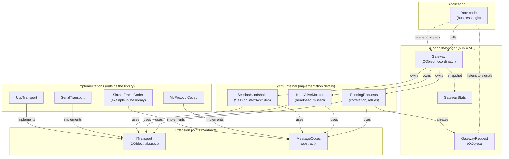

# Architecture

> 🌐 **English** | [Русский](../ru/02-Архитектура.md)

## Layers



## Component roles

| Component | Responsibility | Implemented by |
|---|---|---|
| `Gateway` | Coordinator: state machines (channel, session), routing of decoded messages, reply cache, statistics | Library |
| `gcm::internal::PendingRequests` | Request correlation, retries with backoff, `GatewayRequest` lifecycle | Library (internal) |
| `gcm::internal::KeepAliveMonitor` | Heartbeat timer, missed counter, Suspended/Recovered detection | Library (internal) |
| `gcm::internal::SessionHandshake` | SessionStart/Ack/Stop frames, SessionStartAck wait timer | Library (internal) |
| `GatewayRequest` | Descriptor of a single request awaiting a reply | Library |
| `GatewayStats` | POD snapshot of activity counters | Library |
| [`ITransport`](05-Transport.md) | Abstract byte channel: open/close/send/bytesReceived | Library user |
| [`IMessageCodec`](04-Protocol-and-Codec.md) | Serialization/parsing of frames with correlation | Library user |
| `SimpleFrameCodec` | Reference codec implementation (example format) | Library |

> [!IMPORTANT] Separation principle
> The library knows neither your protocol nor your specific hardware. Any application-specific logic lives behind the `ITransport`/`IMessageCodec` interfaces. This gives three independent axes of extension: transport, codec, business logic.

## Source layout

```
GChannelManager/
├── include/GChannelManager/        ← public headers (PUBLIC include path)
│   ├── GChannelManager_global.h    ← DLL export macro
│   ├── Gateway.h
│   ├── GatewayRequest.h
│   ├── GatewayStats.h
│   ├── IMessageCodec.h
│   ├── ITransport.h
│   ├── SimpleFrameCodec.h
│   ├── RetryPolicy.h
│   ├── KeepAliveConfig.h
│   ├── ReplyCacheConfig.h
│   ├── DecodedMessage.h
│   └── TransportConfig.h
├── src/                             ← implementations (compiled into .so/.dll)
│   ├── Gateway.cpp
│   ├── SimpleFrameCodec.cpp
│   ├── GChannelManager.cpp
│   └── internal/                    ← Gateway collaborators (gcm::internal::)
│       ├── PendingRequests.h/.cpp
│       ├── KeepAliveMonitor.h/.cpp
│       └── SessionHandshake.h/.cpp
├── examples/                        ← optional: GCHANNELMANAGER_BUILD_EXAMPLES=ON
│   ├── demo_peer.cpp                ← demo with a loopback transport
│   └── CMakeLists.txt
├── tests/                           ← optional: GCHANNELMANAGER_BUILD_TESTS=ON
│   ├── tst_SimpleFrameCodec.cpp
│   ├── tst_Gateway.cpp
│   ├── FakeTransport.h
│   └── CMakeLists.txt
└── CMakeLists.txt
```

More about the CMake options — [Build and integration](08-Build-and-Integration.md).

## Object lifecycle

- `Gateway` is created by the user (typically as a class member or on the stack of `QCoreApplication`).
- `ITransport` and `IMessageCodec` are handed to `Gateway` via `std::unique_ptr` → **the gateway takes ownership**. On replacement, the previous object is correctly disconnected and destroyed.
- `GatewayRequest*` is returned from `sendRequest()`. It lives until the `finished()` signal (either success or failure), then calls `deleteLater()` on itself. Connect signals **right after receiving the pointer**, because the first send attempt is deliberately deferred to the next event-loop iteration for exactly this purpose.

## Threading

The library is **single-threaded** and relies on the Qt event loop: all timers (`keep-alive`, `retry`, `stats`) and transport signals are processed in the thread where `Gateway` was created. If you need to move I/O to a separate thread, use `QObject::moveToThread()` on the whole `Gateway + ITransport + IMessageCodec` bundle.

> [!WARNING]
> Do not call `Gateway` methods directly from other threads — use `QMetaObject::invokeMethod(...)` or `QObject::moveToThread()`.
