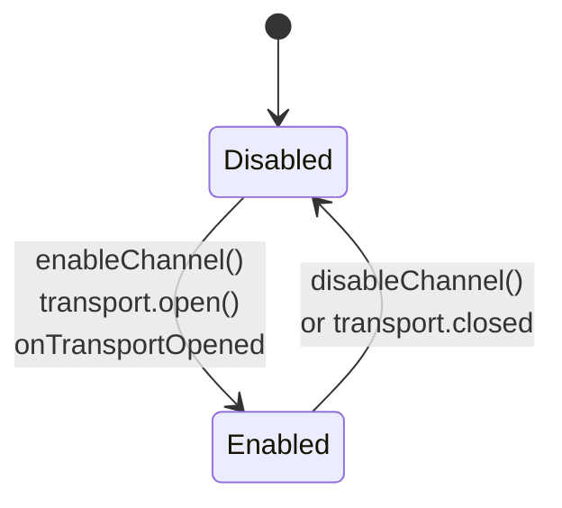
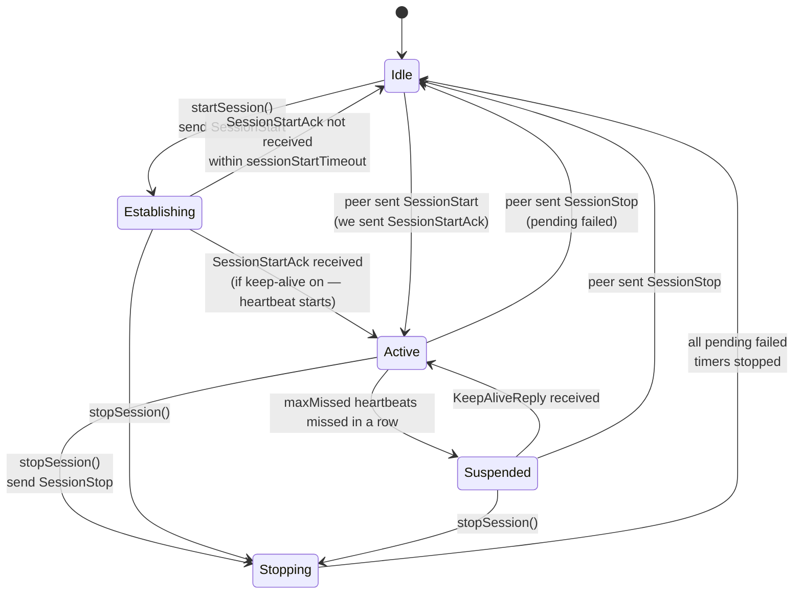
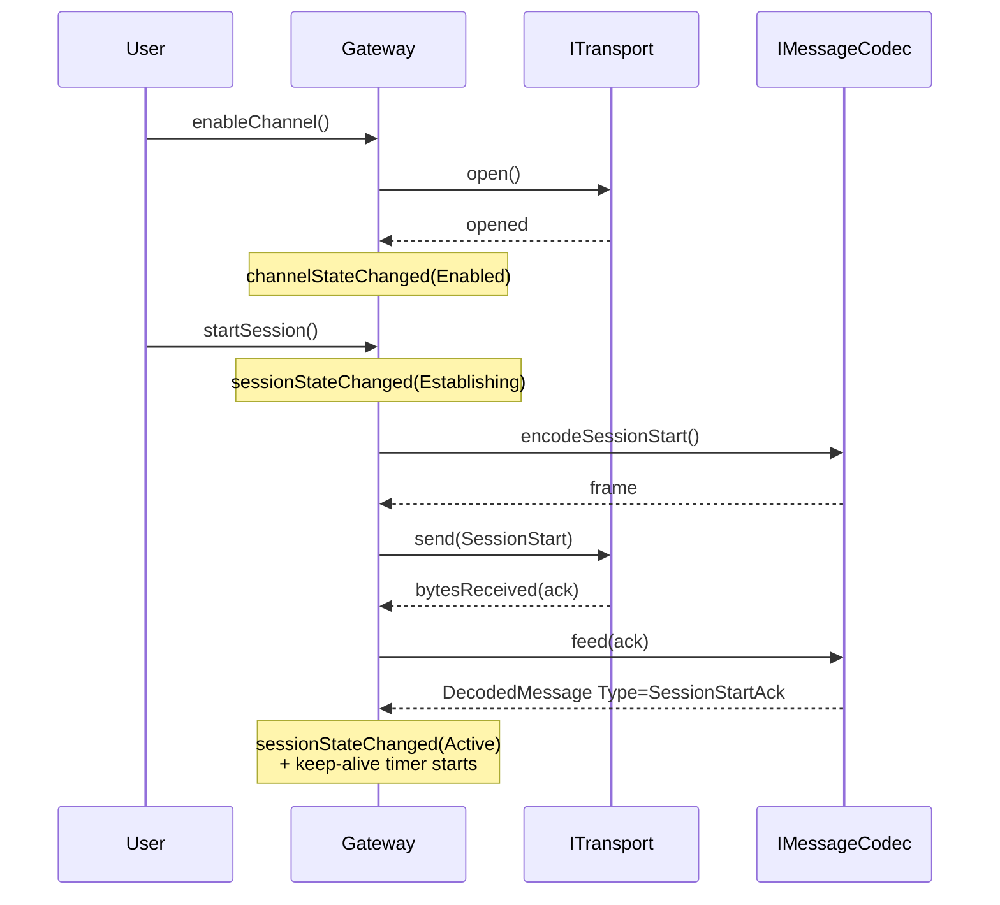
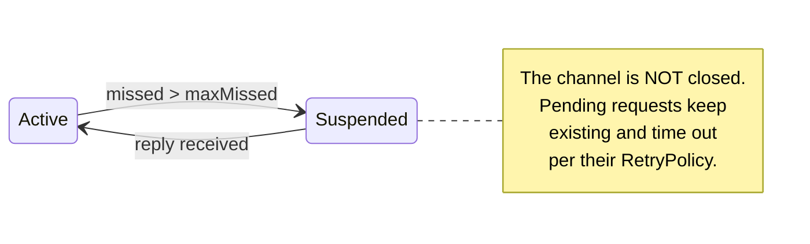

# States and transitions

> 🌐 **English** | [Русский](../ru/03-Состояния-и-переходы.md)

`Gateway` hosts two independent state machines: the **channel** (the physical transport) and the **session** (the logical protocol with heartbeat). The channel can be enabled without an active session. A session cannot exist without an enabled channel.

## Channel

The channel reflects whether the transport is on. There are two states:



| State | Meaning | What you can do |
|---|---|---|
| `Disabled` | Transport closed | `enableChannel()`; cannot `startSession()` |
| `Enabled`  | Transport open and ready to pass bytes | `startSession()`; `disableChannel()` |

> [!NOTE]
> `enableChannel()` is asynchronous: the actual transition to `Enabled` happens after `ITransport::opened()`. Subscribe to the `channelStateChanged` signal to react to readiness.

## Session

The session is a logical "conversation" on top of the channel: keep-alive confirms the link is alive, requests are correlated by `correlationId`. The session has five states:



| State | Description |
|---|---|
| `Idle` | No session. `sendRequest`/`send` → `SessionInactive` |
| `Establishing` | Session is starting: `SessionStart` sent, waiting for `SessionStartAck` from the peer. Timeout — `sessionStartTimeout` |
| `Active` | Session confirmed; requests flow as usual. Keep-alive (if enabled) starts exactly here |
| `Suspended` | The link has been "silent" `maxMissed+1` times in a row (keep-alive does not reply). The channel is still open. Requests are still queued as pending and may time out |
| `Stopping` | Transient state inside `stopSession()` — a `SessionStop` is sent |

> [!TIP] Why `Suspended`
> On an unstable radio channel, short "dropouts" are normal. Closing the transport and reopening it is expensive. `Suspended` lets you ride out a drop without losing the established settings (port, socket parameters), and automatically returns to `Active` as soon as the heartbeat replies.

## Tying the channel and session together



## What happens on a drop

If the transport is silent for `keepAlive.maxMissed + 1` ticks in a row:

1. The Gateway itself, without touching the transport, moves the session to `Suspended`.
2. The channel stays `Enabled` — bytes may keep flowing, the peer simply isn't replying.
3. When at least one `KeepAliveReply` arrives, `onKeepAliveReply()` resets the counter and returns to `Active`.



## Enabling and disabling keep-alive on the fly

`setKeepAliveEnabled(bool)` and `setKeepAliveConfig(...)` work at any time:

| Was / became | Session `Active` | Session `Establishing` | Session `Suspended` |
|---|---|---|---|
| `false → true` | Starts the heartbeat timer, sends the first kalive | Same | Same |
| `true → false` | Timer stops; missed counter is reset | Goes to `Active` | Goes to `Active` |
| only `interval` changed | `QTimer::setInterval(...)` | same | same |

Rationale: if the heartbeat is off, there can be no missed beats, so "the link is alive by default".

See the implementation: `src/Gateway.cpp:133` (`setKeepAliveConfig`).

## Transition signals

```cpp
signals:
    void channelStateChanged(Gateway::ChannelState state);
    void sessionStateChanged(Gateway::SessionState state);
    void keepAliveEnabledChanged(bool enabled);
```

Subscribe **before** calling `enableChannel()`/`startSession()`, otherwise you may miss the early transitions.
