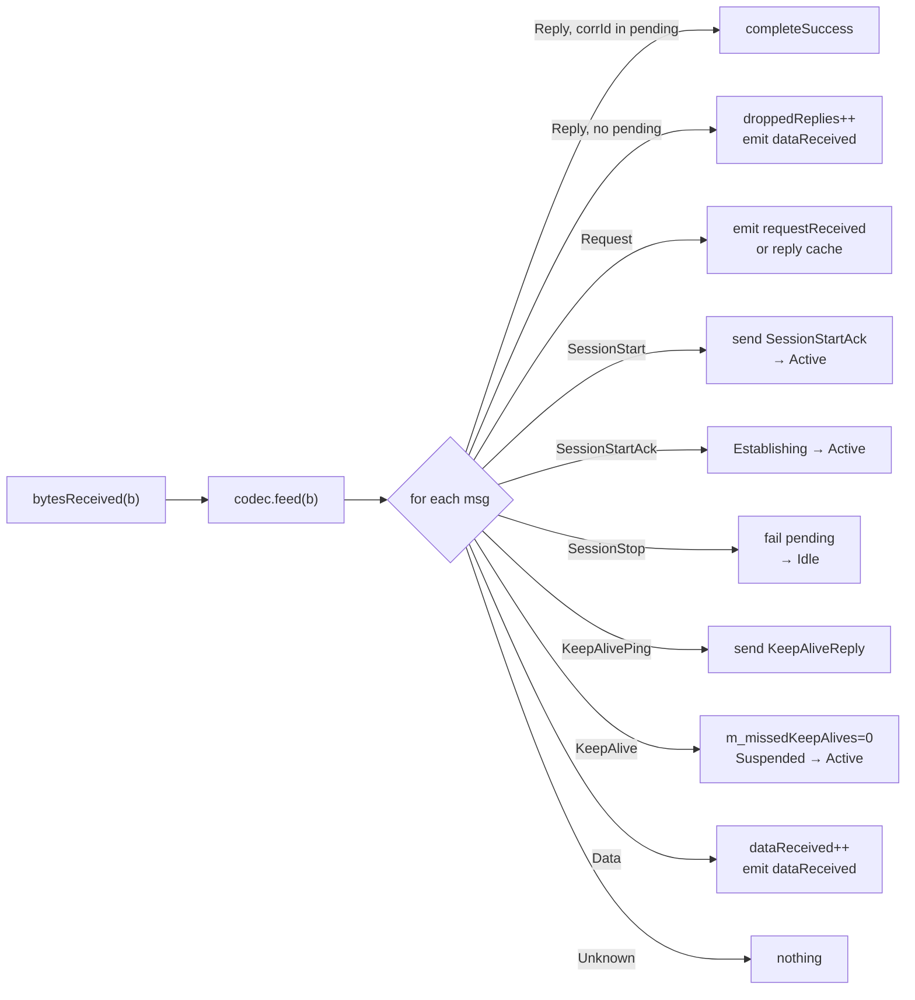

# Protocol and codec

> 🌐 **English** | [Русский](../ru/04-Протокол-и-кодек.md)

## The `IMessageCodec` contract

The codec is everything the library knows about your protocol. The contract is minimal:

```cpp
class IMessageCodec {
public:
    virtual ~IMessageCodec() = default;

    [[nodiscard]] virtual QByteArray encodeRequest(quint32 correlationId,
                                                   const QByteArray &payload) = 0;
    [[nodiscard]] virtual QByteArray encodeReply(quint32 correlationId,
                                                 const QByteArray &payload) = 0;
    [[nodiscard]] virtual QByteArray encodeData(const QByteArray &payload) = 0;
    [[nodiscard]] virtual QByteArray encodeSessionStart()    = 0;
    [[nodiscard]] virtual QByteArray encodeSessionStartAck() = 0;
    [[nodiscard]] virtual QByteArray encodeSessionStop()     = 0;
    [[nodiscard]] virtual QByteArray encodeKeepAlive()       = 0;
    [[nodiscard]] virtual QByteArray encodeKeepAliveReply()  = 0;
    [[nodiscard]] virtual std::vector<DecodedMessage> feed(const QByteArray &bytes) = 0;
    virtual void reset() {}
};
```

| Method | When the Gateway calls it | What it must return |
|---|---|---|
| `encodeRequest(corrId, payload)` | on `sendRequest()` | a request frame with correlation |
| `encodeReply(corrId, payload)` | on `reply()` | a reply frame to an incoming request |
| `encodeData(payload)` | on `send()` (fire-and-forget) | a frame without correlation |
| `encodeSessionStart()` | on `startSession()` | a session-initiation frame |
| `encodeSessionStartAck()` | on receiving SessionStart from the peer | a session-acknowledgement frame |
| `encodeSessionStop()` | on `stopSession()` | a session-termination frame |
| `encodeKeepAlive()` | on the keep-alive timer (only in `Active`) | a heartbeat request frame |
| `encodeKeepAliveReply()` | on an incoming `KeepAlivePing` | a heartbeat reply frame (the pong) |
| `feed(bytes)` | on every `bytesReceived` | a list of decoded messages |
| `reset()` | on `startSession()` and on an incoming `SessionStart` | clear the internal buffer |

## `DecodedMessage`

`feed()` returns a stream of typed messages:

```cpp
struct DecodedMessage {
    enum class Type {
        Reply,            // reply to our request → look at correlationId
        Request,          // request from the peer to us → Gateway::reply()
        SessionStart,     // peer opens a session
        SessionStartAck,  // peer acknowledged our SessionStart
        SessionStop,      // peer closes a session
        KeepAlivePing,    // keep-alive request from the peer → Gateway auto-answers
        KeepAlive,        // keep-alive reply (link liveness confirmation)
        Data,             // data without correlation (push from the peer)
        Unknown           // unrecognized / service
    };
    Type       type          = Type::Unknown;
    quint32    correlationId = 0;   // valid for Reply and Request
    QByteArray payload;
};
```

The Gateway processes them in `onTransportBytes()`:



> [!NOTE] Buffering
> `feed()` must **buffer** incomplete frames between calls. This is part of the contract: the transport may deliver an arbitrary portion of a frame in one `bytesReceived` and the rest in the next.

## SimpleFrameCodec

`SimpleFrameCodec` is a reference implementation. It is an **example**, not part of the contract: in production you write your own codec for your own protocol.

### Frame format

Little-endian, a fixed 10-byte header and a 2-byte trailing CRC:

```
 0       1       2  3  4  5    6  7  8  9    10 ........    .. ..
┌───────┬───────┬─────────────┬─────────────┬──────────────┬───────┐
│ magic │ type  │   corrId    │     len     │   payload    │ crc16 │
│ 0xA5  │ u8    │   u32 LE    │   u32 LE    │   len bytes   │ u16 LE│
└───────┴───────┴─────────────┴─────────────┴──────────────┴───────┘
   1       1          4             4          variable        2
```

`crc16` is CRC-16/CCITT-FALSE over everything from `magic` through the end of
`payload`. `len` is capped at `SimpleFrameCodec::kMaxPayloadSize` (16 MiB); a
header claiming more is treated as line noise.

`type` values:

| Name              | Value | When it is sent                          | `DecodedMessage` type |
|---|---|---|---|
| `Request`         | 1 | `encodeRequest(corrId, payload)`         | `Request` |
| `Reply`           | 2 | `encodeReply(corrId, payload)`           | `Reply` |
| `KeepAliveReq`    | 3 | `encodeKeepAlive()`                      | `KeepAlivePing` (Gateway answers with `KeepAliveReply`) |
| `KeepAliveReply`  | 4 | `encodeKeepAliveReply()` (answer to a ping) | `KeepAlive` |
| `Data`            | 5 | `encodeData(payload)` (fire-and-forget)  | `Data` |
| `SessionStart`    | 6 | `encodeSessionStart()` on `startSession()` | `SessionStart` |
| `SessionStartAck` | 7 | `encodeSessionStartAck()` in reply       | `SessionStartAck` |
| `SessionStop`     | 8 | `encodeSessionStop()` on `stopSession()` | `SessionStop` |

> [!NOTE]
> `corrId == 0` is reserved for keep-alive and fire-and-forget. Real `Request` frames get `corrId ≥ 1`.

### Resynchronization and integrity

If there is no `0xA5` at the start of the buffer, the parser shifts by one byte and looks for the magic again. A frame whose trailing CRC does not match (a flipped bit, or a `0xA5` that was not really a frame start) is likewise dropped and the parser resynchronizes — so corruption on the line cannot be delivered as valid data or desync the stream permanently.

### Utility API

`SimpleFrameCodec` exports two static convenience methods so that you can build test peers / loopback transports (as in `examples/demo_peer.cpp`):

```cpp
static QByteArray makeFrame(quint8 type, quint32 corrId, const QByteArray &payload);
static std::vector<RawFrame> parse(QByteArray &buffer);   // consumes what it parses
```

`parse()` is low-level: it returns a `RawFrame{type, corrId, payload}` structure without `DecodedMessage::Type` classification. Handy in tests and demos.

## Writing your own codec

You must implement every pure-virtual `encode*`/`feed` method (`reset` is optional); a few are shown here:

```cpp
class MyProtocolCodec : public IMessageCodec {
public:
    QByteArray encodeRequest(quint32 corrId, const QByteArray &p) override {
        return makeFrame(MY_REQUEST, corrId, p);
    }
    QByteArray encodeData(const QByteArray &p) override {
        return makeFrame(MY_DATA, 0, p);     // corrId unused
    }
    QByteArray encodeKeepAlive() override {
        return makeFrame(MY_HEARTBEAT, 0, {});
    }
    QByteArray encodeKeepAliveReply() override {
        return makeFrame(MY_HEARTBEAT_ACK, 0, {});   // answer to a peer's ping
    }
    std::vector<DecodedMessage> feed(const QByteArray &bytes) override {
        m_buf.append(bytes);
        std::vector<DecodedMessage> out;
        // ... parse + classify → out.push_back(...)
        return out;
    }
    void reset() override { m_buf.clear(); }
private:
    QByteArray m_buf;
};
```

After that:

```cpp
gw.setCodec(std::make_unique<MyProtocolCodec>());
```

More about the implementation rules — in [setCodec](06-Gateway-API.md#setcodec).
