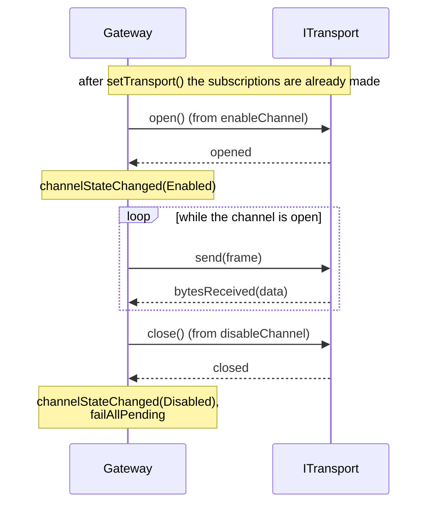

# Transport

> 🌐 **English** | [Русский](../ru/05-Транспорт.md)

## The `ITransport` contract

The transport is an asynchronous byte channel. The library relies on exactly this interface:

```cpp
class ITransport : public QObject {
    Q_OBJECT
public:
    enum class State { Closed, Opening, Open, Closing, Error };
    Q_ENUM(State)

    [[nodiscard]] virtual State   state() const = 0;
    [[nodiscard]] virtual QString name()  const = 0;
    [[nodiscard]] bool isOpen() const { return state() == State::Open; }

public slots:
    virtual void open()  = 0;
    virtual void close() = 0;
    virtual qint64 send(const QByteArray &data) = 0;

signals:
    void stateChanged(ITransport::State state);
    void opened();
    void closed();
    void bytesReceived(const QByteArray &data);
    void errorOccurred(const QString &message);
};
```

## Implementation rules

| Rule | Meaning |
|---|---|
| `open()` is asynchronous | The method **returns immediately**; the actual open is confirmed by the `opened()` signal (or `errorOccurred()`) |
| `close()` is asynchronous | Same: the `closed()` signal arrives later |
| `send()` is non-blocking | Must queue the data and return without delay. Returns the number of accepted bytes, or `-1` on error |
| `bytesReceived()` | Carries **raw bytes** (an arbitrary chunk). The Gateway feeds them to the codec via `feed()`, and the codec buffers them |
| States | `Opening`/`Closing` are transient; `Error` is terminal (an explicit `open()` is required to retry) |

> [!WARNING]
> Do not emit signals synchronously from inside `open()`/`close()`/`send()` directly: when building `connect(...)` chains this can lead to re-entrancy and hangs. Use `QMetaObject::invokeMethod(..., Qt::QueuedConnection)` or `QTimer::singleShot(0, this, ...)`.

## What the Gateway does with the transport



On `errorOccurred`, the gateway does not close the channel automatically (that decision is left to the user) — it merely forwards the message outward through its own `Gateway::errorOccurred("transport: …")`.

## Transport configuration

`include/GChannelManager/TransportConfig.h` holds settings structures for typical implementations:

### SerialConfig

```cpp
namespace transport {

struct SerialConfig {
    QString portName;                 // "COM3", "/dev/ttyUSB0"
    qint32  baudRate = 115200;
    qint32  dataBits = 8;

    enum class Parity      { None, Even, Odd, Space, Mark };
    enum class StopBits    { One, OneAndHalf, Two };
    enum class FlowControl { None, Hardware, Software };

    Parity      parity      = Parity::None;
    StopBits    stopBits    = StopBits::One;
    FlowControl flowControl = FlowControl::None;

    std::chrono::milliseconds writeTimeout{500};
};

}
```

### UdpConfig

```cpp
struct UdpConfig {
    QHostAddress localAddress  = QHostAddress::AnyIPv4;
    quint16      localPort     = 0;       // 0 — any free port
    QHostAddress remoteAddress;           // destination peer address
    quint16      remotePort    = 0;
    bool         bindBeforeSend = true;   // bind the socket on open()
};
```

> [!NOTE]
> The `SerialTransport` and `UdpTransport` implementations themselves **are not part** of the library: they must be written for your Qt stack (`QtSerialPort`, `QtNetwork`). The structures above are only data definitions, so that the contract stays "light" and does not pull in those modules as dependencies.

## A minimal implementation — example from `tests/`

The tests use `FakeTransport` — a simple controllable transport with no real I/O:

```cpp
class FakeTransport : public ITransport {
    Q_OBJECT
public:
    using ITransport::ITransport;

    State   state() const override { return m_state; }
    QString name()  const override { return QStringLiteral("fake"); }

    void simulateReceive(const QByteArray &bytes) {
        if (m_state == State::Open)
            emit bytesReceived(bytes);
    }

public slots:
    void open() override {
        m_state = State::Open;
        emit stateChanged(m_state);
        emit opened();
    }
    void close() override {
        m_state = State::Closed;
        emit stateChanged(m_state);
        emit closed();
    }
    qint64 send(const QByteArray &data) override {
        if (m_state != State::Open) return -1;
        m_sent.append(data);
        return data.size();
    }

private:
    State              m_state = State::Closed;
    QList<QByteArray>  m_sent;
};
```

The full code is in `tests/FakeTransport.h`. It is also a template for any future implementation.

## Loopback with delays and losses — `demo_peer.cpp`

`examples/demo_peer.cpp` shows a slightly more realistic demo transport: it simulates a responder peer, replies with a delay via `QTimer::singleShot`, and randomly "drops" ~40% of requests to vividly demonstrate the retry mechanism in `Gateway`. To enable the build, use the `-DGCHANNELMANAGER_BUILD_EXAMPLES=ON` flag (see [Build and integration](08-Build-and-Integration.md)).
