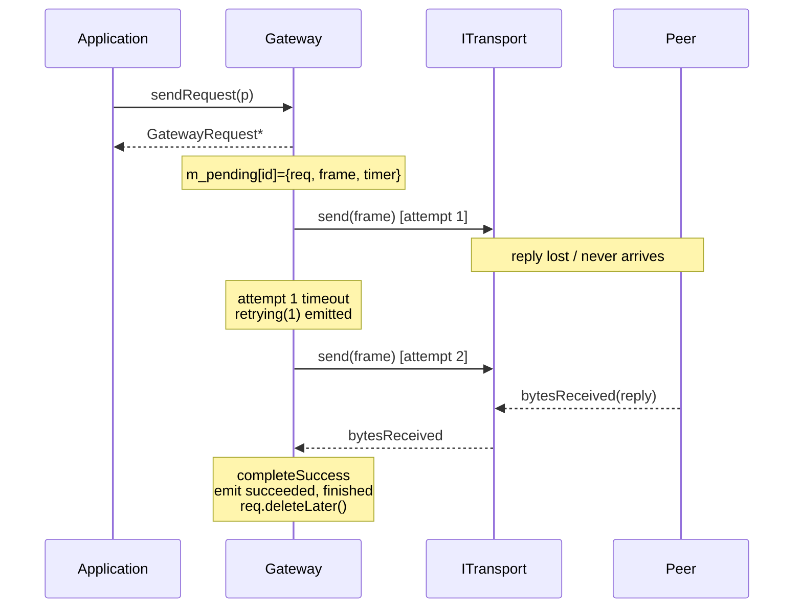

# Gateway API

> 🌐 **English** | [Русский](../ru/06-Gateway-API.md)

The complete public API of the `Gateway` class and related types.

## Setting dependencies

### setTransport

```cpp
void Gateway::setTransport(std::unique_ptr<ITransport> transport);
[[nodiscard]] ITransport *transport() const;
```

Transfers ownership of the transport. If a transport was already set, the previous one is disconnected (`disableChannel()`), detached from all signals, and destroyed. Signal connections are made automatically: `opened`, `closed`, `bytesReceived`, `errorOccurred`.

### setCodec

```cpp
void Gateway::setCodec(std::unique_ptr<IMessageCodec> codec);
[[nodiscard]] IMessageCodec *codec() const;
```

Transfers ownership of the codec. Replacing the codec during a running session is possible, but **you must not mix frames from different codecs**: if needed, do `stopSession()` first.

## Channel

```cpp
public slots:
    void enableChannel();
    void disableChannel();

public:
    [[nodiscard]] ChannelState channelState() const;
    [[nodiscard]] bool isChannelEnabled() const;

signals:
    void channelStateChanged(Gateway::ChannelState state);
```

More about the transitions — [Channel](03-States-and-Transitions.md#channel).

## Session

```cpp
public slots:
    void startSession();   // sends SessionStart, waits for SessionStartAck
    void stopSession();    // sends SessionStop, moves the session to Idle

public:
    [[nodiscard]] SessionState sessionState() const;
    [[nodiscard]] bool isSessionActive() const;

    // SessionStartAck wait timeout (0 — no timeout)
    void setSessionStartTimeout(std::chrono::milliseconds timeout);
    [[nodiscard]] std::chrono::milliseconds sessionStartTimeout() const;

signals:
    void sessionStateChanged(Gateway::SessionState state);
    void sessionStartReceived();   // peer initiated a session with us
    void sessionStopReceived();    // peer ended the session
```

The session lifecycle is driven by three separate frames — `SessionStart`, `SessionStartAck`, `SessionStop` — and is **independent** of keep-alive. Keep-alive is used only to check link liveness after `Active` (see [States and transitions](03-States-and-Transitions.md#session)).

Behavior:

- `startSession()` → sends `SessionStart`, state `Idle → Establishing`. When `SessionStartAck` arrives, state `Establishing → Active` and (if keep-alive is enabled) the heartbeat starts.
- If the ack does not arrive within `sessionStartTimeout` — `errorOccurred` + rollback to `Idle`. The default timeout is 5 seconds; `0` disables it (wait forever).
- `stopSession()` → sends `SessionStop`, fails all pending requests (`SessionInactive`), state → `Idle`.
- An incoming `SessionStart` from the peer → automatically sends `SessionStartAck`, state → `Active`, signal `sessionStartReceived`.
- An incoming `SessionStop` → fails pending, state → `Idle`, signal `sessionStopReceived`.

## Keep-alive

### KeepAliveConfig

```cpp
struct KeepAliveConfig {
    bool   enabled    = true;
    std::chrono::milliseconds interval{2000};
    qint32 maxMissed  = 3;   // misses in a row before going Suspended
};
```

### API

```cpp
void setKeepAliveConfig(const KeepAliveConfig &k);
[[nodiscard]] KeepAliveConfig keepAliveConfig() const;
[[nodiscard]] bool isKeepAliveEnabled() const;

public slots:
    void setKeepAliveEnabled(bool enabled);

signals:
    void keepAliveEnabledChanged(bool enabled);
```

`setKeepAliveConfig` is applied **on the fly**: if a session is running, a change to `enabled`/`interval` is picked up immediately. See the transition matrix table in the [keep-alive section](03-States-and-Transitions.md#enabling-and-disabling-keep-alive-on-the-fly).

## send

Fire-and-forget sending:

```cpp
bool send(const QByteArray &payload);
```

Sends arbitrary data **without correlation and without waiting for a reply**. Returns `true` if the frame was queued on the transport (`transport.send()` returned ≥ 0).

Preconditions (otherwise `false` + `errorOccurred`):
- a codec is set,
- the channel is `Enabled`,
- the session is not `Idle`/`Stopping`,
- the transport is open.

> [!NOTE]
> The correlation identifier inside the library is used only for requests awaiting a reply. In a fire-and-forget frame `corrId == 0`.

## sendRequest

A request awaiting a reply.

### RetryPolicy

```cpp
struct RetryPolicy {
    qint32 maxRetries = 3;                       // retries AFTER the first attempt
    std::chrono::milliseconds timeout{1000};     // wait for a reply per attempt
    double backoffFactor = 1.5;                  // timeout multiplier per retry
    std::chrono::milliseconds maxTimeout{15000}; // timeout ceiling
};
```

The effective timeout of attempt `n` (numbered from 0):

```
t(n) = min(timeout * backoffFactor^n, maxTimeout)
```

### API

```cpp
void setDefaultRetryPolicy(const RetryPolicy &p);
[[nodiscard]] RetryPolicy defaultRetryPolicy() const;

GatewayRequest *sendRequest(const QByteArray &payload);
GatewayRequest *sendRequest(const QByteArray &payload, const RetryPolicy &policy);
```

`sendRequest()` returns a pointer to a freshly created `GatewayRequest*`. The first send of the frame to the transport is done via `QTimer::singleShot(0, ...)`, so that you have time to connect signals:

```cpp
auto *req = gw.sendRequest(QByteArray("ping"));
connect(req, &GatewayRequest::succeeded, this, &MyClass::onPong);
connect(req, &GatewayRequest::failed,    this, &MyClass::onPongFailed);
```

### Attempt lifecycle



## GatewayRequest

A descriptor of a single request:

```cpp
class GatewayRequest : public QObject {
    Q_OBJECT
public:
    enum class Status { Pending, Succeeded, Failed };
    enum class Error  { None, Timeout, Cancelled,
                        ChannelDisabled, SessionInactive, TransportError };

    [[nodiscard]] quint32 id()          const;   // = correlationId
    [[nodiscard]] qint32  attempts()    const;
    [[nodiscard]] qint32  maxAttempts() const;   // = 1 + maxRetries
    [[nodiscard]] Status  status()      const;
    [[nodiscard]] Error   error()       const;
    [[nodiscard]] bool    isFinished()  const;
    [[nodiscard]] const QByteArray &payload()  const;
    [[nodiscard]] const QByteArray &response() const;

public slots:
    void cancel();

signals:
    void succeeded(const QByteArray &response);
    void failed(GatewayRequest::Error error);
    void retrying(qint32 attempt);
    void finished();                  // exactly once
};
```

Guarantees:

- `succeeded` or `failed` arrives exactly once.
- After `finished()`, the object calls `deleteLater()`.
- You must connect signals **right after** `sendRequest()`, before returning to the event loop.

## Server role: incoming requests and `reply()`

Beyond sending requests, `Gateway` can also **answer** requests initiated by the peer. When the codec decodes an incoming frame as `DecodedMessage::Type::Request`, the gateway emits a signal, and the application produces a reply via the `reply()` slot.

```cpp
signals:
    void requestReceived(quint32 correlationId, const QByteArray &payload);

public slots:
    bool reply(quint32 correlationId, const QByteArray &response);
```

- `requestReceived(corrId, payload)` — the peer sent a request. The `corrId` must be passed back into `reply()` so the peer can match the response.
- `reply(corrId, response)` — encodes the response via `encodeReply(corrId, response)` and sends it to the transport. Returns `true` if the frame was queued (codec set, transport open). If the reply cache is enabled, the response is also remembered.

```cpp
connect(&gw, &Gateway::requestReceived, this,
    [&](quint32 corrId, const QByteArray &payload) {
        const QByteArray result = handleCommand(payload);
        gw.reply(corrId, result);
    });
```

## Reply cache (server role)

The link is unreliable, and our reply may be lost along the way — in which case the peer resends the same `Request` with the same `corrId`. The reply cache (idempotency cache) stores every successfully sent `reply()`; on a repeated request with a known `corrId`, the gateway resends the stored reply itself and does **not** re-emit `requestReceived` (the command is not executed twice).

### ReplyCacheConfig

```cpp
struct ReplyCacheConfig {
    bool   enabled    = false;   // disabled by default
    qint32 maxEntries = 256;     // LRU eviction backed by QCache
};
```

### API

```cpp
void setReplyCacheConfig(const ReplyCacheConfig &c);
[[nodiscard]] ReplyCacheConfig replyCacheConfig() const;
[[nodiscard]] bool isReplyCacheEnabled() const;
void clearReplyCache();

public slots:
    void setReplyCacheEnabled(bool enabled);   // on/off on the fly

signals:
    void replyCacheEnabledChanged(bool enabled);
```

- `setReplyCacheConfig(...)` / `setReplyCacheEnabled(bool)` work **on the fly**. Disabling the cache clears the accumulated entries.
- Resends from the cache are counted by `stats.cachedRepliesResent` (see [Statistics](07-Statistics.md)).

> [!NOTE]
> The cache is disabled by default: enable it only if your protocol allows the peer to resend a request and the idempotency of the response matters.

## Statistics

```cpp
[[nodiscard]] GatewayStats stats() const;
void setStatsInterval(std::chrono::milliseconds interval);   // 0 — disable
[[nodiscard]] std::chrono::milliseconds statsInterval() const;
void resetStats();

signals:
    void statsUpdated(GatewayStats stats);
```

The `GatewayStats` fields and the list of increments are on a separate page: [Statistics](07-Statistics.md).

## Miscellaneous

```cpp
signals:
    void errorOccurred(const QString &message);     // transport/preconditions
    void dataReceived(const QByteArray &payload);   // uncorrelated data (push)
```

`dataReceived` arrives for:
- `DecodedMessage::Type::Data` (explicit push frames);
- `DecodedMessage::Type::Reply` whose `correlationId` is **not in `m_pending`** (an orphan). These are also counted in `stats.droppedReplies`.

## Types in full (for reference)

```cpp
enum class ChannelState { Disabled, Enabled };
enum class SessionState { Idle, Establishing, Active, Suspended, Stopping };
```

All enums are marked `Q_ENUM`, so they work with `QSignalSpy`, `QMetaEnum::keyToValue`, and QML.
