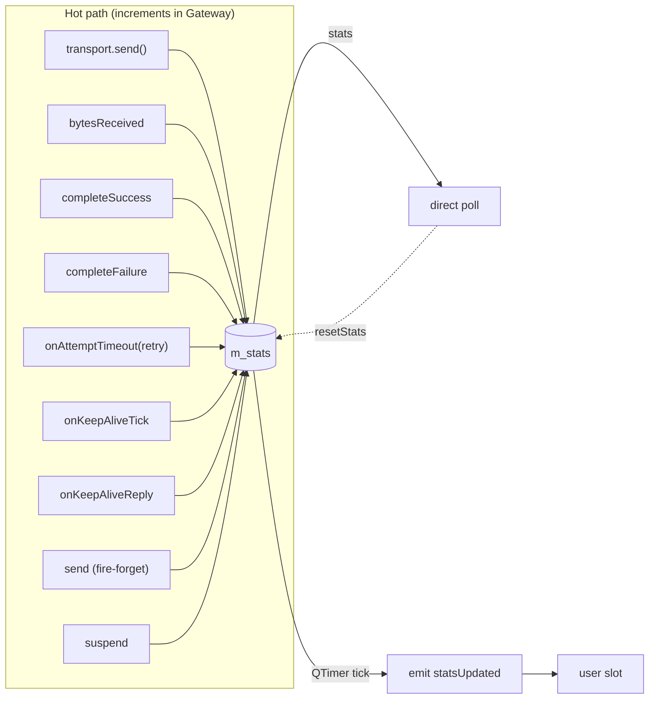

# Statistics

> 🌐 **English** | [Русский](../ru/07-Статистика.md)

Lightweight observation of gateway activity: bytes, requests, retries, heartbeats, drops. Cheap on the hot path — plain `quint64` increments. You can poll on demand or subscribe to a periodic signal.

## `GatewayStats`

A POD structure (`include/GChannelManager/GatewayStats.h`):

```cpp
struct GatewayStats {
    quint64 sentBytes          = 0;
    quint64 recvBytes          = 0;
    quint64 requestsSent       = 0;
    quint64 requestsSucceeded  = 0;
    quint64 requestsFailed     = 0;
    quint64 retries            = 0;
    quint64 fireAndForgetSent  = 0;
    quint64 keepAlivesSent     = 0;
    quint64 keepAlivesReceived = 0;
    quint64 suspensions        = 0;
    quint64 droppedReplies     = 0;
    quint64 dataReceived       = 0;
    quint64 incomingRequests   = 0;   // Request frames from the peer
    quint64 cachedRepliesResent = 0;  // replies resent from the cache
    quint64 sessionStartsSent     = 0;
    quint64 sessionStartsReceived = 0;
    quint64 sessionStartTimeouts  = 0;
    quint64 sessionStopsSent      = 0;
    quint64 sessionStopsReceived  = 0;
};
Q_DECLARE_METATYPE(GatewayStats)
```

## When each counter grows

| Counter | Incremented on |
|---|---|
| `sentBytes` | every successful `transport->send(frame)` (keep-alive, fire-and-forget, request attempts, retries) |
| `recvBytes` | every `onTransportBytes(bytes)` (raw bytes before parsing) |
| `requestsSent` | `sendRequest` after passing preconditions and inserting into `m_pending` |
| `requestsSucceeded` | `completeSuccess()` — a `Reply` with a known `corrId` arrived |
| `requestsFailed` | `completeFailure()` or `failLater()` (preconditions failed, timeout, cancel, drop) |
| `retries` | a retry attempt on timeout (i.e. `onAttemptTimeout` decides "retry, not timeout") |
| `fireAndForgetSent` | a successful `Gateway::send(payload)` |
| `keepAlivesSent` | every `onKeepAliveTick` that sent a heartbeat |
| `keepAlivesReceived` | `onKeepAliveReply()` (a `DecodedMessage::Type::KeepAlive` arrived) |
| `suspensions` | an `Active`/`Establishing` → `Suspended` transition due to missed heartbeats |
| `droppedReplies` | a `Reply` with a `corrId` not in pending (late reply / someone else's) |
| `dataReceived` | `DecodedMessage::Type::Data` from the codec |
| `incomingRequests` | `DecodedMessage::Type::Request` — a request from the peer to us |
| `cachedRepliesResent` | a repeated `Request` with the same `corrId` served from the reply cache (see [Reply cache](06-Gateway-API.md#reply-cache-server-role)) |
| `sessionStartsSent` | a `SessionStart` was sent (`startSession()`) |
| `sessionStartsReceived` | a `SessionStart` was received from the peer |
| `sessionStartTimeouts` | a `SessionStartAck` did not arrive within `sessionStartTimeout` |
| `sessionStopsSent` | a `SessionStop` was sent (`stopSession()`) |
| `sessionStopsReceived` | a `SessionStop` was received from the peer |

> [!NOTE] What is not counted
> Channel states (`Disabled`/`Enabled`) and session transitions (except `suspensions`) have no dedicated counters — they are already observable via the `channelStateChanged`/`sessionStateChanged` signals.

## API

```cpp
[[nodiscard]] GatewayStats stats() const;            // snapshot of now
void setStatsInterval(std::chrono::milliseconds);    // 0 — disable
[[nodiscard]] std::chrono::milliseconds statsInterval() const;
void resetStats();                                   // zero all fields

signals:
    void statsUpdated(GatewayStats stats);
```

## Periodic emission

By default `statsInterval = 0` and the periodic signal does not fire. Enable it with a single call:

```cpp
gw.setStatsInterval(std::chrono::milliseconds(1000));
connect(&gw, &Gateway::statsUpdated, this, &Dashboard::onStats);
```

Disable:

```cpp
gw.setStatsInterval(std::chrono::milliseconds(0));
```

Under the hood there is a separate `QTimer` (`m_statsTimer`), independent of `keep-alive`. The emission is a **full snapshot**, without a diff: the dashboard itself decides whether to compare against the previous value.

## Example of collecting metrics

```cpp
class Dashboard : public QObject {
    Q_OBJECT
public slots:
    void onStats(const GatewayStats &s)
    {
        const double lossRate = (s.requestsSent == 0)
            ? 0.0
            : double(s.requestsFailed) / double(s.requestsSent);

        qInfo().nospace()
            << "tx=" << s.sentBytes << "B  rx=" << s.recvBytes << "B  "
            << "req(ok/fail/retry)=" << s.requestsSucceeded
            << "/" << s.requestsFailed
            << "/" << s.retries
            << "  loss=" << QString::number(lossRate * 100, 'f', 1) << "%"
            << "  suspensions=" << s.suspensions;
    }
};
```

## Counter data flow



## Verification in tests

In `tests/tst_Gateway.cpp` there are four cases:

- `stats_countersTrackKeepAliveAndRequest` — keep-alive counters and `requestsSucceeded` after a round-trip.
- `stats_droppedReplyCounted` — a `Reply` with an unknown `corrId` → `droppedReplies == 1`.
- `stats_periodicSignalFires_andStopsOnZeroInterval` — the timer emits, `setStatsInterval(0)` stops it.
- `stats_resetClearsCounters` — `resetStats()` zeros everything.

See the details — [Testing](09-Testing.md).
