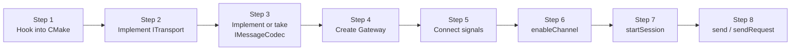
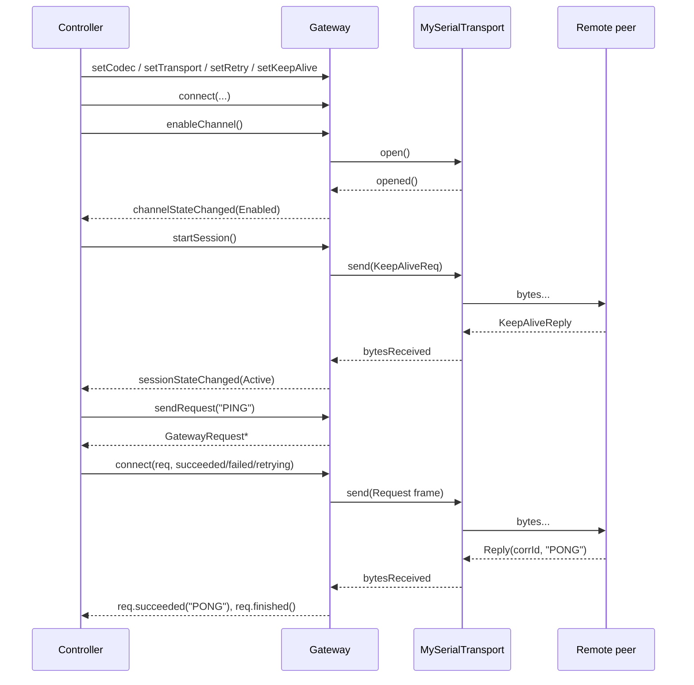

# User guide

> 🌐 **English** | [Русский](../ru/10-Руководство-пользователя.md)

A step-by-step walkthrough of how to plug `GChannelManager` into a real project. Along the way — where to look in the documentation if you need to go deeper.

## Step map



## Step 1. Hooking into CMake

Put the repository next to your project or in `third_party/`:

```cmake
add_subdirectory(third_party/GChannelManager)
target_link_libraries(myapp PRIVATE GChannelManager)
```

After that the includes work:

```cpp
#include <GChannelManager/Gateway.h>
#include <GChannelManager/SimpleFrameCodec.h>
// ... your transport
```

Details and options — [Build and integration](08-Build-and-Integration.md).

## Step 2. Transport

The transport is the one thing you almost always have to write from scratch: the library deliberately does not pull in `QtSerialPort`/`QtNetwork` implementations. A minimal template:

```cpp
// MySerialTransport.h
#pragma once
#include <GChannelManager/ITransport.h>
#include <GChannelManager/TransportConfig.h>
#include <QSerialPort>

class MySerialTransport : public ITransport
{
    Q_OBJECT
public:
    explicit MySerialTransport(transport::SerialConfig cfg, QObject *parent = nullptr);

    State   state() const override { return m_state; }
    QString name()  const override { return m_cfg.portName; }

public slots:
    void   open()  override;
    void   close() override;
    qint64 send(const QByteArray &data) override;

private slots:
    void onReadyRead();
    void onSerialError(QSerialPort::SerialPortError e);

private:
    void setState(State s);

    transport::SerialConfig m_cfg;
    QSerialPort             m_port;
    State                   m_state = State::Closed;
};
```

```cpp
// MySerialTransport.cpp
MySerialTransport::MySerialTransport(transport::SerialConfig cfg, QObject *parent)
    : ITransport(parent), m_cfg(std::move(cfg))
{
    connect(&m_port, &QSerialPort::readyRead, this, &MySerialTransport::onReadyRead);
    connect(&m_port, &QSerialPort::errorOccurred,
            this, &MySerialTransport::onSerialError);
}

void MySerialTransport::open()
{
    if (m_state == State::Open) return;
    setState(State::Opening);

    m_port.setPortName(m_cfg.portName);
    m_port.setBaudRate(m_cfg.baudRate);
    m_port.setDataBits(QSerialPort::DataBits(m_cfg.dataBits));
    // ... the rest of the parameters from SerialConfig

    if (!m_port.open(QIODevice::ReadWrite)) {
        setState(State::Error);
        emit errorOccurred(m_port.errorString());
        return;
    }
    setState(State::Open);
    emit opened();
}

void MySerialTransport::close()
{
    if (m_state == State::Closed) return;
    setState(State::Closing);
    m_port.close();
    setState(State::Closed);
    emit closed();
}

qint64 MySerialTransport::send(const QByteArray &data)
{
    if (m_state != State::Open) return -1;
    return m_port.write(data);
}

void MySerialTransport::onReadyRead()
{
    emit bytesReceived(m_port.readAll());
}

void MySerialTransport::onSerialError(QSerialPort::SerialPortError e)
{
    if (e != QSerialPort::NoError)
        emit errorOccurred(m_port.errorString());
}

void MySerialTransport::setState(State s)
{
    if (m_state == s) return;
    m_state = s;
    emit stateChanged(s);
}
```

The full contract — [Transport](05-Transport.md).

## Step 3. Codec

If your protocol matches `SimpleFrameCodec` (`[magic][type][corrId][len][payload]`) — use it as is. Otherwise write your own per the [Protocol and codec](04-Protocol-and-Codec.md) contract:

```cpp
class MyProtoCodec : public IMessageCodec {
public:
    QByteArray encodeRequest(quint32 corrId, const QByteArray &p) override { /* ... */ }
    QByteArray encodeData(const QByteArray &p) override                   { /* ... */ }
    QByteArray encodeKeepAlive() override                                  { /* ... */ }
    std::vector<DecodedMessage> feed(const QByteArray &bytes) override     { /* ... */ }
    void reset() override                                                  { /* ... */ }
};
```

## Step 4. Creating the Gateway

```cpp
#include <GChannelManager/Gateway.h>
#include <GChannelManager/SimpleFrameCodec.h>
#include "MySerialTransport.h"

class Controller : public QObject {
    Q_OBJECT
public:
    Controller() {
        m_gw.setCodec(std::make_unique<SimpleFrameCodec>());
        m_gw.setTransport(std::make_unique<MySerialTransport>(
            transport::SerialConfig{ .portName = "/dev/ttyUSB0",
                                      .baudRate = 115200 }));

        // retries: 3 retries, initial timeout 500 ms, 1.5x backoff
        Gateway::RetryPolicy retry;
        retry.maxRetries    = 3;
        retry.timeout       = std::chrono::milliseconds(500);
        retry.backoffFactor = 1.5;
        m_gw.setDefaultRetryPolicy(retry);

        // keep-alive every 2 s, up to 3 misses in a row
        Gateway::KeepAliveConfig ka;
        ka.enabled   = true;
        ka.interval  = std::chrono::seconds(2);
        ka.maxMissed = 3;
        m_gw.setKeepAliveConfig(ka);
    }

private:
    Gateway m_gw;
};
```

## Step 5. Connecting signals

Connect **before** `enableChannel()` — otherwise you will miss the early transitions.

```cpp
connect(&m_gw, &Gateway::channelStateChanged, this, &Controller::onChannel);
connect(&m_gw, &Gateway::sessionStateChanged, this, &Controller::onSession);
connect(&m_gw, &Gateway::errorOccurred,       this, &Controller::onError);
connect(&m_gw, &Gateway::dataReceived,        this, &Controller::onPush);
```

```cpp
void Controller::onChannel(Gateway::ChannelState s)
{
    if (s == Gateway::ChannelState::Enabled)
        m_gw.startSession();
}

void Controller::onSession(Gateway::SessionState s)
{
    if (s == Gateway::SessionState::Active)
        emit ready();
}
```

## Steps 6 and 7. Enabling the channel and starting the session

```cpp
m_gw.enableChannel();
// startSession() will be called in the onChannel slot on the transition to Enabled
```

It can be simpler if the transport opens instantly (tests/local pipes):

```cpp
m_gw.enableChannel();
m_gw.startSession();   // safe: the gateway checks isChannelEnabled() itself
```

## Step 8. Sending

### Fire-and-forget

```cpp
if (!m_gw.send(QByteArray("EVENT:button-pressed")))
    qWarning() << "send failed";
```

See [send](06-Gateway-API.md#send).

### Awaiting a reply

```cpp
auto *req = m_gw.sendRequest(QByteArray("GET_TEMP"));

connect(req, &GatewayRequest::succeeded, this,
    [](const QByteArray &resp) { qInfo() << "temp =" << resp; });

connect(req, &GatewayRequest::retrying, this,
    [](qint32 attempt) { qInfo() << "retry #" << attempt; });

connect(req, &GatewayRequest::failed, this,
    [](GatewayRequest::Error e) {
        qWarning() << "request failed, error =" << qint32(e);
    });
```

Details — [sendRequest](06-Gateway-API.md#sendrequest).

### Custom retry policy

```cpp
Gateway::RetryPolicy stubborn;
stubborn.maxRetries    = 10;
stubborn.timeout       = std::chrono::milliseconds(200);
stubborn.backoffFactor = 2.0;
stubborn.maxTimeout    = std::chrono::seconds(10);

auto *req = m_gw.sendRequest(QByteArray("CRITICAL"), stubborn);
```

### Cancellation

```cpp
req->cancel();   // → failed(Cancelled), finished()
```

## The full call sequence



## Enabling statistics

```cpp
m_gw.setStatsInterval(std::chrono::milliseconds(1000));
connect(&m_gw, &Gateway::statsUpdated, this,
        [](const GatewayStats &s) {
    qInfo().nospace()
        << "tx="  << s.sentBytes << "B "
        << "rx="  << s.recvBytes << "B "
        << "req=" << s.requestsSucceeded
        << "/"    << s.requestsFailed
        << " retries="    << s.retries
        << " suspensions="<< s.suspensions;
});
```

The full list of fields — [Statistics](07-Statistics.md).

## Subtleties

> [!WARNING] Connect immediately
> `Gateway::sendRequest()` defers the first attempt to `QTimer::singleShot(0, ...)`, specifically so that you can `connect(...)` to `req`. If you ignore the returned pointer there is no leak (the object self-destructs), but you will miss all signals.

> [!WARNING] Connect signals before `enable*()`
> Connect to `channelStateChanged` / `sessionStateChanged` **before** `enableChannel()`. Otherwise the early transition to `Enabled` will go unnoticed.

> [!TIP] Suspended is normal
> If the link disappears for seconds, the library does not reset the channel. Don't try to "help" by calling `disableChannel()` — let the gateway ride out the dip on its own. If you want to force termination — use `stopSession()` (but not `disableChannel()` if you need the port to stay open).

> [!TIP] Requests during `Suspended`
> `sendRequest` does not fail in `Suspended`: the request is queued in `m_pending` and sent over the transport. If the link is silent, the attempts will time out per the `RetryPolicy`. If you want *not* to send during `Suspended` — check `isSessionActive()` before the call.

## Common problems

| Symptom | Cause | Fix |
|---|---|---|
| `sendRequest` immediately `failed(SessionInactive)` | `startSession()` not called or the session is `Idle` | subscribe to `sessionStateChanged` and send on `Active` |
| `sessionStateChanged(Active)` never arrives | The codec does not classify the reply as `KeepAlive` | check `feed()` returns `DecodedMessage::Type::KeepAlive` for the heartbeat reply |
| Requests time out even though the peer replies | The `corrId` in the `Reply` does not match the one in the `Request` | the codec inverts/truncates the id — check the parser |
| `errorOccurred("send: ...")` | `send()` with no active session / a closed transport | `enableChannel()` + `startSession()` first |
| `Gateway` builds, but symbols from the `.so` are not visible (Windows) | Forgot `GCHANNELMANAGER_EXPORT` on a new public class | add the macro before the class name |

## Full mini-example (no business logic)

```cpp
#include <QCoreApplication>
#include <QObject>
#include <QTimer>
#include <GChannelManager/Gateway.h>
#include <GChannelManager/SimpleFrameCodec.h>
#include "MySerialTransport.h"

int main(int argc, char **argv)
{
    QCoreApplication app(argc, argv);

    Gateway gw;
    gw.setCodec(std::make_unique<SimpleFrameCodec>());
    gw.setTransport(std::make_unique<MySerialTransport>(
        transport::SerialConfig{ .portName = "/dev/ttyUSB0",
                                  .baudRate = 115200 }));

    Gateway::KeepAliveConfig ka;
    ka.interval  = std::chrono::seconds(1);
    ka.maxMissed = 3;
    gw.setKeepAliveConfig(ka);

    QObject::connect(&gw, &Gateway::channelStateChanged,
        [&](Gateway::ChannelState s) {
            if (s == Gateway::ChannelState::Enabled)
                gw.startSession();
        });

    QObject::connect(&gw, &Gateway::sessionStateChanged,
        [&](Gateway::SessionState s) {
            if (s != Gateway::SessionState::Active) return;

            auto *req = gw.sendRequest(QByteArray("HELLO"));
            QObject::connect(req, &GatewayRequest::succeeded,
                [&](const QByteArray &resp) {
                    qInfo() << "peer says:" << resp;
                    app.quit();
                });
            QObject::connect(req, &GatewayRequest::failed,
                [&](GatewayRequest::Error) {
                    qWarning() << "request failed";
                    app.quit();
                });
        });

    gw.enableChannel();
    return app.exec();
}
```

A ready-to-run example with a loopback peer and losses — `examples/demo_peer.cpp`. To run:

```sh
cmake -S . -B build -DGCHANNELMANAGER_BUILD_EXAMPLES=ON
cmake --build build
LD_LIBRARY_PATH="$PWD/build" ./build/examples/GChannelManagerDemo
```

## Where to look next

- State machines and edge cases — [States and transitions](03-States-and-Transitions.md)
- Your own codec — [Writing your own codec](04-Protocol-and-Codec.md#writing-your-own-codec)
- Your own transport — [Implementation rules](05-Transport.md#implementation-rules)
- What is counted and how — [Statistics](07-Statistics.md)
- Unit-testing patterns — [Testing](09-Testing.md)
