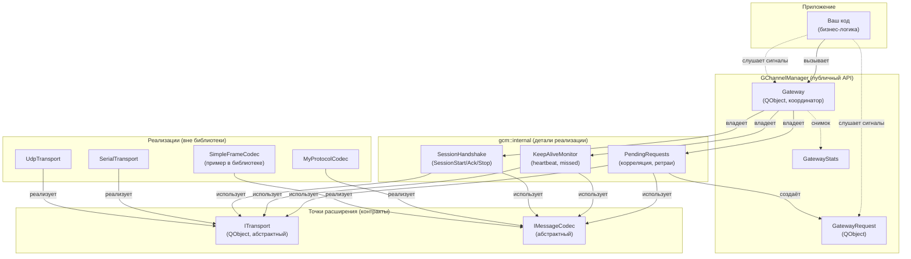

# Архитектура

## Слои



## Роли компонентов

| Компонент | Зона ответственности | Кто реализует |
|---|---|---|
| `Gateway` | Координатор: машины состояний (канал, сессия), маршрутизация декодированных сообщений, кэш ответов, статистика | Библиотека |
| `gcm::internal::PendingRequests` | Корреляция запросов, ретраи с backoff, lifecycle `GatewayRequest` | Библиотека (internal) |
| `gcm::internal::KeepAliveMonitor` | Heartbeat-таймер, счётчик пропусков, детекция Suspended/Recovered | Библиотека (internal) |
| `gcm::internal::SessionHandshake` | Кадры SessionStart/Ack/Stop, таймер ожидания SessionStartAck | Библиотека (internal) |
| `GatewayRequest` | Дескриптор одного запроса с ожиданием ответа | Библиотека |
| `GatewayStats` | POD-снимок счётчиков активности | Библиотека |
| [`ITransport`](05-Транспорт.md) | Абстрактный канал байт: open/close/send/bytesReceived | Пользователь библиотеки |
| [`IMessageCodec`](04-Протокол-и-кодек.md) | Сериализация/разбор кадров с корреляцией | Пользователь библиотеки |
| `SimpleFrameCodec` | Эталонная реализация кодека (пример формата) | Библиотека |

> [!IMPORTANT] Принцип разделения
> Библиотека не знает ни вашего протокола, ни конкретного железа. Любая прикладная специфика лежит за интерфейсами `ITransport`/`IMessageCodec`. Это даёт три независимые оси расширения: транспорт, кодек, бизнес-логика.

## Структура исходников

```
GChannelManager/
├── include/GChannelManager/        ← публичные заголовки (PUBLIC include path)
│   ├── GChannelManager_global.h    ← макрос экспорта DLL
│   ├── Gateway.h
│   ├── GatewayRequest.h
│   ├── GatewayStats.h
│   ├── IMessageCodec.h
│   ├── ITransport.h
│   ├── SimpleFrameCodec.h
│   ├── RetryPolicy.h
│   ├── KeepAliveConfig.h
│   ├── ReplyCacheConfig.h
│   ├── DecodedMessage.h
│   └── TransportConfig.h
├── src/                             ← реализации (компилируются в .so/.dll)
│   ├── Gateway.cpp
│   ├── SimpleFrameCodec.cpp
│   ├── GChannelManager.cpp
│   └── internal/                    ← коллабораторы Gateway (gcm::internal::)
│       ├── PendingRequests.h/.cpp
│       ├── KeepAliveMonitor.h/.cpp
│       └── SessionHandshake.h/.cpp
├── examples/                        ← опционально: GCHANNELMANAGER_BUILD_EXAMPLES=ON
│   ├── demo_peer.cpp                ← демо с loopback-транспортом
│   └── CMakeLists.txt
├── tests/                           ← опционально: GCHANNELMANAGER_BUILD_TESTS=ON
│   ├── tst_SimpleFrameCodec.cpp
│   ├── tst_Gateway.cpp
│   ├── FakeTransport.h
│   └── CMakeLists.txt
└── CMakeLists.txt
```

Подробнее про опции CMake — [Сборка и интеграция](08-Сборка-и-интеграция.md).

## Жизненный цикл объектов

- `Gateway` создаётся пользователем (обычно как член класса/на стеке `QCoreApplication`).
- `ITransport` и `IMessageCodec` передаются в `Gateway` через `std::unique_ptr` → **гейтвей становится владельцем**. При замене предыдущий объект корректно отсоединяется и удаляется.
- `GatewayRequest*` возвращается из `sendRequest()`. Он живёт до сигнала `finished()` (либо успех, либо отказ), затем вызывает `deleteLater()` самостоятельно. Подключать сигналы нужно **сразу после получения указателя**, потому что первая попытка отправки откладывается на следующую итерацию цикла событий специально для этой цели.

## Потоки исполнения

Библиотека **однопоточная** и опирается на цикл событий Qt: все таймеры (`keep-alive`, `retry`, `stats`) и сигналы транспорта обрабатываются в потоке, где создан `Gateway`. Если вам нужно вынести ввод-вывод в отдельный поток, используйте `QObject::moveToThread()` для всей связки `Gateway + ITransport + IMessageCodec`.

> [!WARNING]
> Не вызывайте методы `Gateway` из других потоков напрямую — используйте `QMetaObject::invokeMethod(...)` или `QObject::moveToThread()`.
