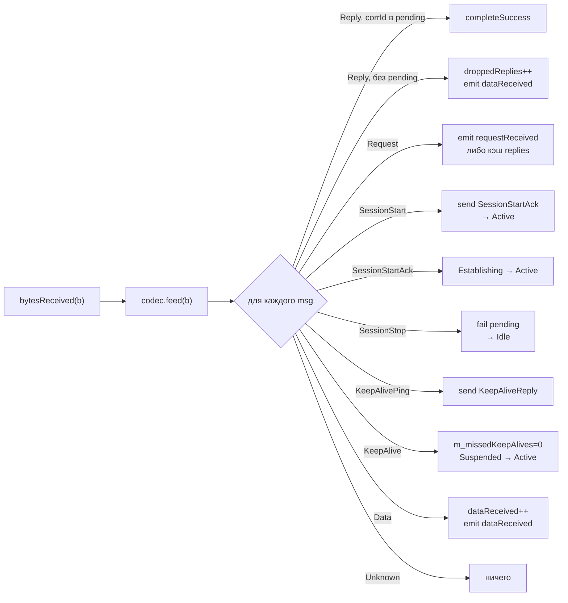

# Протокол и кодек

## Контракт `IMessageCodec`

Кодек — это всё, что библиотека знает о вашем протоколе. Контракт минимален:

```cpp
class IMessageCodec {
public:
    virtual ~IMessageCodec() = default;

    [[nodiscard]] virtual QByteArray encodeRequest(quint32 correlationId,
                                                   const QByteArray &payload) = 0;
    [[nodiscard]] virtual QByteArray encodeReply(quint32 correlationId,
                                                 const QByteArray &payload) = 0;
    [[nodiscard]] virtual QByteArray encodeData(const QByteArray &payload) = 0;
    [[nodiscard]] virtual QByteArray encodeSessionStart()    = 0;
    [[nodiscard]] virtual QByteArray encodeSessionStartAck() = 0;
    [[nodiscard]] virtual QByteArray encodeSessionStop()     = 0;
    [[nodiscard]] virtual QByteArray encodeKeepAlive()       = 0;
    [[nodiscard]] virtual QByteArray encodeKeepAliveReply()  = 0;
    [[nodiscard]] virtual std::vector<DecodedMessage> feed(const QByteArray &bytes) = 0;
    virtual void reset() {}
};
```

| Метод | Когда вызывает Gateway | Что должен вернуть |
|---|---|---|
| `encodeRequest(corrId, payload)` | при `sendRequest()` | кадр запроса с корреляцией |
| `encodeReply(corrId, payload)` | при `reply()` | кадр ответа на входящий запрос |
| `encodeData(payload)` | при `send()` (fire-and-forget) | кадр без корреляции |
| `encodeSessionStart()` | при `startSession()` | кадр инициации сессии |
| `encodeSessionStartAck()` | при получении SessionStart от узла | кадр подтверждения сессии |
| `encodeSessionStop()` | при `stopSession()` | кадр завершения сессии |
| `encodeKeepAlive()` | по таймеру keep-alive (только в `Active`) | heartbeat-кадр (запрос) |
| `encodeKeepAliveReply()` | при входящем `KeepAlivePing` | heartbeat-кадр (ответ, pong) |
| `feed(bytes)` | при каждом `bytesReceived` | список разобранных сообщений |
| `reset()` | при `startSession()` и при входящем `SessionStart` | очистить внутренний буфер |

## `DecodedMessage`

`feed()` возвращает поток типизированных сообщений:

```cpp
struct DecodedMessage {
    enum class Type {
        Reply,            // ответ на наш запрос → смотрим correlationId
        Request,          // запрос от узла к нам → Gateway::reply()
        SessionStart,     // узел открывает сессию
        SessionStartAck,  // узел подтвердил наш SessionStart
        SessionStop,      // узел закрывает сессию
        KeepAlivePing,    // keep-alive-запрос от узла → Gateway отвечает сам
        KeepAlive,        // keep-alive-ответ (подтверждение живости линка)
        Data,             // данные без корреляции (push от узла)
        Unknown           // не распознано / служебное
    };
    Type       type          = Type::Unknown;
    quint32    correlationId = 0;   // valid для Reply и Request
    QByteArray payload;
};
```

Gateway обрабатывает их в `onTransportBytes()`:



> [!NOTE] Буферизация
> `feed()` должен **буферизовать** неполные кадры между вызовами. Это часть контракта: транспорт может доставить произвольную часть кадра в одном `bytesReceived`, остаток — в следующем.

## SimpleFrameCodec

`SimpleFrameCodec` — эталонная реализация. Это **пример**, а не часть контракта: в продакшене вы пишете свой кодек под свой протокол.

### Формат кадра

Little-endian, фиксированный заголовок 10 байт и 2-байтовый CRC в конце:

```
 0       1       2  3  4  5    6  7  8  9    10 ........    .. ..
┌───────┬───────┬─────────────┬─────────────┬──────────────┬───────┐
│ magic │ type  │   corrId    │     len     │   payload    │ crc16 │
│ 0xA5  │ u8    │   u32 LE    │   u32 LE    │   len байт    │ u16 LE│
└───────┴───────┴─────────────┴─────────────┴──────────────┴───────┘
   1       1          4             4          переменно        2
```

`crc16` — это CRC-16/CCITT-FALSE по всему диапазону от `magic` до конца
`payload`. `len` ограничен `SimpleFrameCodec::kMaxPayloadSize` (16 МиБ); заголовок
с бо́льшим значением считается мусором на линии.

Значения `type`:

| Имя               | Значение | Когда отправляется                       | Тип в `DecodedMessage` |
|---|---|---|---|
| `Request`         | 1 | `encodeRequest(corrId, payload)`         | `Request` |
| `Reply`           | 2 | `encodeReply(corrId, payload)`           | `Reply` |
| `KeepAliveReq`    | 3 | `encodeKeepAlive()`                      | `KeepAlivePing` (Gateway отвечает `KeepAliveReply`) |
| `KeepAliveReply`  | 4 | `encodeKeepAliveReply()` (ответ на ping) | `KeepAlive` |
| `Data`            | 5 | `encodeData(payload)` (fire-and-forget)  | `Data` |
| `SessionStart`    | 6 | `encodeSessionStart()` при `startSession()` | `SessionStart` |
| `SessionStartAck` | 7 | `encodeSessionStartAck()` в ответ        | `SessionStartAck` |
| `SessionStop`     | 8 | `encodeSessionStop()` при `stopSession()` | `SessionStop` |

> [!NOTE]
> `corrId == 0` зарезервирован для keep-alive и fire-and-forget. Реальные `Request`-кадры получают `corrId ≥ 1`.

### Ресинхронизация и целостность

Если в начале буфера нет `0xA5`, парсер сдвигает позицию на 1 байт и ищет magic заново. Кадр, у которого не сошёлся хвостовой CRC (перевёрнутый бит или `0xA5`, который не был началом кадра), так же отбрасывается с ресинхронизацией — поэтому повреждение на линии не доставляется как валидные данные и не рассинхронизирует поток навсегда.

### API утилит

`SimpleFrameCodec` экспортирует два статических метода-удобства, чтобы вы могли строить тестовые узлы/loopback-транспорты (как в `examples/demo_peer.cpp`):

```cpp
static QByteArray makeFrame(quint8 type, quint32 corrId, const QByteArray &payload);
static std::vector<RawFrame> parse(QByteArray &buffer);   // потребляет разобранное
```

`parse()` — низкоуровневый: возвращает структуру `RawFrame{type, corrId, payload}` без классификации `DecodedMessage::Type`. Удобен в тестах и демо.

## Написание собственного кодека

Нужно реализовать все чисто виртуальные `encode*`/`feed` (`reset` опционален); ниже показаны лишь некоторые:

```cpp
class MyProtocolCodec : public IMessageCodec {
public:
    QByteArray encodeRequest(quint32 corrId, const QByteArray &p) override {
        return makeFrame(MY_REQUEST, corrId, p);
    }
    QByteArray encodeData(const QByteArray &p) override {
        return makeFrame(MY_DATA, 0, p);     // corrId не используем
    }
    QByteArray encodeKeepAlive() override {
        return makeFrame(MY_HEARTBEAT, 0, {});
    }
    QByteArray encodeKeepAliveReply() override {
        return makeFrame(MY_HEARTBEAT_ACK, 0, {});   // ответ на ping узла
    }
    std::vector<DecodedMessage> feed(const QByteArray &bytes) override {
        m_buf.append(bytes);
        std::vector<DecodedMessage> out;
        // ... парсинг + классификация → out.push_back(...)
        return out;
    }
    void reset() override { m_buf.clear(); }
private:
    QByteArray m_buf;
};
```

После этого:

```cpp
gw.setCodec(std::make_unique<MyProtocolCodec>());
```

Подробнее про правила реализации — в [setCodec](06-Gateway-API.md#setcodec).
