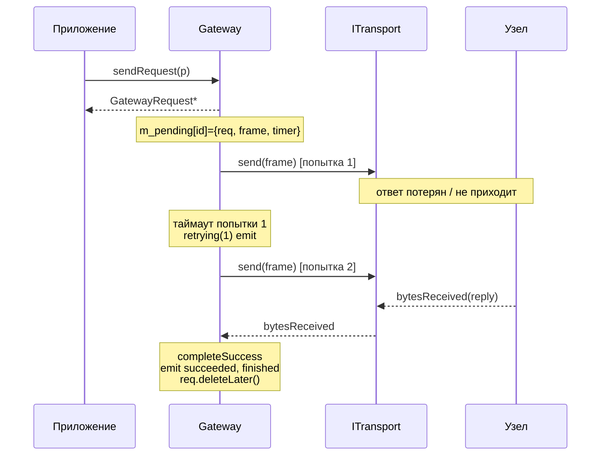

# Gateway API

Полное публичное API класса `Gateway` и связанных типов.

## Установка зависимостей

### setTransport

```cpp
void Gateway::setTransport(std::unique_ptr<ITransport> transport);
[[nodiscard]] ITransport *transport() const;
```

Передаёт владение транспортом. Если транспорт уже был установлен, предыдущий отключается (`disableChannel()`), отвязывается от всех сигналов и удаляется. Подключение сигналов происходит автоматически: `opened`, `closed`, `bytesReceived`, `errorOccurred`.

### setCodec

```cpp
void Gateway::setCodec(std::unique_ptr<IMessageCodec> codec);
[[nodiscard]] IMessageCodec *codec() const;
```

Передаёт владение кодеком. Замена кодека в работающей сессии возможна, но **смешивать кадры разных кодеков нельзя**: при необходимости предварительно сделайте `stopSession()`.

## Канал

```cpp
public slots:
    void enableChannel();
    void disableChannel();

public:
    [[nodiscard]] ChannelState channelState() const;
    [[nodiscard]] bool isChannelEnabled() const;

signals:
    void channelStateChanged(Gateway::ChannelState state);
```

Подробнее про переходы — [Канал](03-Состояния-и-переходы.md#канал).

## Сессия

```cpp
public slots:
    void startSession();   // отправляет SessionStart, ждёт SessionStartAck
    void stopSession();    // отправляет SessionStop, переводит сессию в Idle

public:
    [[nodiscard]] SessionState sessionState() const;
    [[nodiscard]] bool isSessionActive() const;

    // таймаут ожидания SessionStartAck (0 — без таймаута)
    void setSessionStartTimeout(std::chrono::milliseconds timeout);
    [[nodiscard]] std::chrono::milliseconds sessionStartTimeout() const;

signals:
    void sessionStateChanged(Gateway::SessionState state);
    void sessionStartReceived();   // peer инициировал сессию с нами
    void sessionStopReceived();    // peer завершил сессию
```

Lifecycle сессии управляется тремя отдельными кадрами — `SessionStart`, `SessionStartAck`, `SessionStop` — и **не зависит** от keep-alive. Keep-alive используется только для проверки живости линии после `Active` (см. [Состояния и переходы](03-Состояния-и-переходы.md#сессия)).

Поведение:

- `startSession()` → отправляет `SessionStart`, состояние `Idle → Establishing`. Когда придёт `SessionStartAck`, состояние `Establishing → Active` и (если включён keep-alive) стартует heartbeat.
- Если ack не пришёл за `sessionStartTimeout` — `errorOccurred` + откат в `Idle`. По умолчанию таймаут 5 секунд; `0` отключает его (ждать бесконечно).
- `stopSession()` → отправляет `SessionStop`, проваливает все pending запросы (`SessionInactive`), состояние → `Idle`.
- Входящий `SessionStart` от узла → автоматически отправляется `SessionStartAck`, состояние → `Active`, сигнал `sessionStartReceived`.
- Входящий `SessionStop` → проваливает pending, состояние → `Idle`, сигнал `sessionStopReceived`.

## Keep-alive

### KeepAliveConfig

```cpp
struct KeepAliveConfig {
    bool   enabled    = true;
    std::chrono::milliseconds interval{2000};
    qint32 maxMissed  = 3;   // пропусков подряд до перехода в Suspended
};
```

### API

```cpp
void setKeepAliveConfig(const KeepAliveConfig &k);
[[nodiscard]] KeepAliveConfig keepAliveConfig() const;
[[nodiscard]] bool isKeepAliveEnabled() const;

public slots:
    void setKeepAliveEnabled(bool enabled);

signals:
    void keepAliveEnabledChanged(bool enabled);
```

`setKeepAliveConfig` применяется **на лету**: если сессия запущена, изменение `enabled`/`interval` подхватывается немедленно. См. таблицу матрицы переходов в [разделе keep-alive](03-Состояния-и-переходы.md#включение-и-выключение-keep-alive-на-лету).

## send

Fire-and-forget отправка:

```cpp
bool send(const QByteArray &payload);
```

Отправляет произвольные данные **без корреляции и без ожидания ответа**. Возвращает `true`, если кадр поставлен в очередь транспорта (`transport.send()` вернул ≥ 0).

Предусловия (иначе `false` + `errorOccurred`):
- кодек установлен,
- канал `Enabled`,
- сессия не в `Idle`/`Stopping`,
- транспорт открыт.

> [!NOTE]
> Корреляционный идентификатор внутри библиотеки используется только для запросов с ожиданием ответа. В fire-and-forget кадре `corrId == 0`.

## sendRequest

Запрос с ожиданием ответа.

### RetryPolicy

```cpp
struct RetryPolicy {
    qint32 maxRetries = 3;                       // повторов ПОСЛЕ первой попытки
    std::chrono::milliseconds timeout{1000};     // ожидание ответа на попытку
    double backoffFactor = 1.5;                  // множитель таймаута на повтор
    std::chrono::milliseconds maxTimeout{15000}; // потолок таймаута
};
```

Эффективный таймаут попытки `n` (нумерация с 0):

```
t(n) = min(timeout * backoffFactor^n, maxTimeout)
```

### API

```cpp
void setDefaultRetryPolicy(const RetryPolicy &p);
[[nodiscard]] RetryPolicy defaultRetryPolicy() const;

GatewayRequest *sendRequest(const QByteArray &payload);
GatewayRequest *sendRequest(const QByteArray &payload, const RetryPolicy &policy);
```

`sendRequest()` возвращает указатель на свежесозданный `GatewayRequest*`. Первая отправка кадра в транспорт делается через `QTimer::singleShot(0, ...)`, чтобы вы успели подключить сигналы:

```cpp
auto *req = gw.sendRequest(QByteArray("ping"));
connect(req, &GatewayRequest::succeeded, this, &MyClass::onPong);
connect(req, &GatewayRequest::failed,    this, &MyClass::onPongFailed);
```

### Жизненный цикл попыток



## GatewayRequest

Дескриптор одного запроса:

```cpp
class GatewayRequest : public QObject {
    Q_OBJECT
public:
    enum class Status { Pending, Succeeded, Failed };
    enum class Error  { None, Timeout, Cancelled,
                        ChannelDisabled, SessionInactive, TransportError };

    [[nodiscard]] quint32 id()          const;   // = correlationId
    [[nodiscard]] qint32  attempts()    const;
    [[nodiscard]] qint32  maxAttempts() const;   // = 1 + maxRetries
    [[nodiscard]] Status  status()      const;
    [[nodiscard]] Error   error()       const;
    [[nodiscard]] bool    isFinished()  const;
    [[nodiscard]] const QByteArray &payload()  const;
    [[nodiscard]] const QByteArray &response() const;

public slots:
    void cancel();

signals:
    void succeeded(const QByteArray &response);
    void failed(GatewayRequest::Error error);
    void retrying(qint32 attempt);
    void finished();                  // ровно один раз
};
```

Гарантии:

- `succeeded` или `failed` приходит ровно один раз.
- После `finished()` объект делает `deleteLater()`.
- Подписку нужно делать **сразу** после `sendRequest()`, до возврата в цикл событий.

## Серверная роль: входящие запросы и `reply()`

Помимо отправки запросов, `Gateway` умеет **отвечать** на запросы, инициированные узлом. Когда кодек разбирает входящий кадр как `DecodedMessage::Type::Request`, гейтвей эмитит сигнал, а приложение формирует ответ слотом `reply()`.

```cpp
signals:
    void requestReceived(quint32 correlationId, const QByteArray &payload);

public slots:
    bool reply(quint32 correlationId, const QByteArray &response);
```

- `requestReceived(corrId, payload)` — узел прислал запрос. `corrId` нужно вернуть обратно в `reply()`, чтобы узел сопоставил ответ.
- `reply(corrId, response)` — кодирует ответ через `encodeReply(corrId, response)` и отправляет в транспорт. Возвращает `true`, если кадр поставлен в очередь (кодек установлен, транспорт открыт). Если включён кэш ответов — ответ дополнительно запоминается.

```cpp
connect(&gw, &Gateway::requestReceived, this,
    [&](quint32 corrId, const QByteArray &payload) {
        const QByteArray result = handleCommand(payload);
        gw.reply(corrId, result);
    });
```

## Кэш ответов (серверная роль)

Линия ненадёжна, и наш ответ может потеряться по дороге — тогда узел повторит тот же `Request` с тем же `corrId`. Кэш ответов (idempotency cache) хранит каждый успешно отправленный `reply()`; при повторном запросе с известным `corrId` гейтвей сам перешлёт сохранённый ответ и **не** будет повторно эмитить `requestReceived` (команда не выполнится дважды).

### ReplyCacheConfig

```cpp
struct ReplyCacheConfig {
    bool   enabled    = false;   // по умолчанию выключен
    qint32 maxEntries = 256;     // эвикция LRU поверх QCache
};
```

### API

```cpp
void setReplyCacheConfig(const ReplyCacheConfig &c);
[[nodiscard]] ReplyCacheConfig replyCacheConfig() const;
[[nodiscard]] bool isReplyCacheEnabled() const;
void clearReplyCache();

public slots:
    void setReplyCacheEnabled(bool enabled);   // вкл/выкл на лету

signals:
    void replyCacheEnabledChanged(bool enabled);
```

- `setReplyCacheConfig(...)` / `setReplyCacheEnabled(bool)` работают **на лету**. Выключение кэша очищает накопленные записи.
- Кэш также очищается на каждой **границе сессии** — `startSession`/`stopSession`, входящие `SessionStart`/`SessionStop`, закрытие транспорта. Поэтому переподключившийся узел, который перезапускает свои `corrId`, не получит ответ, закэшированный для другого запроса из прошлой сессии.
- Внутри одной сессии `corrId` должен однозначно идентифицировать один payload запроса (TTL нет — вытеснение LRU по числу записей). `maxEntries` должен быть `>= 1` (иначе зажимается).
- Повторная отправка из кэша учитывается счётчиком `stats.cachedRepliesResent` (см. [Статистика](07-Статистика.md)).

> [!NOTE]
> Кэш по умолчанию выключен: включайте его только если ваш протокол допускает повтор запроса узлом и идемпотентность ответа важна.

## Статистика

```cpp
[[nodiscard]] GatewayStats stats() const;
void setStatsInterval(std::chrono::milliseconds interval);   // 0 — отключить
[[nodiscard]] std::chrono::milliseconds statsInterval() const;
void resetStats();

signals:
    void statsUpdated(GatewayStats stats);
```

Поля `GatewayStats` и список инкрементов — отдельная страница: [Статистика](07-Статистика.md).

## Прочее

```cpp
signals:
    void errorOccurred(const QString &message);     // транспорт/предусловия
    void dataReceived(const QByteArray &payload);   // некоррелированные данные (push)
```

`dataReceived` приходит для:
- `DecodedMessage::Type::Data` (явные push-кадры);
- `DecodedMessage::Type::Reply`, у которого `correlationId` **нет в `m_pending`** (orphan). Такие также учитываются в `stats.droppedReplies`.

## Типы целиком (для справки)

```cpp
enum class ChannelState { Disabled, Enabled };
enum class SessionState { Idle, Establishing, Active, Suspended, Stopping };
```

Все enum помечены `Q_ENUM`, поэтому работают с `QSignalSpy`, `QMetaEnum::keyToValue`, и QML.
